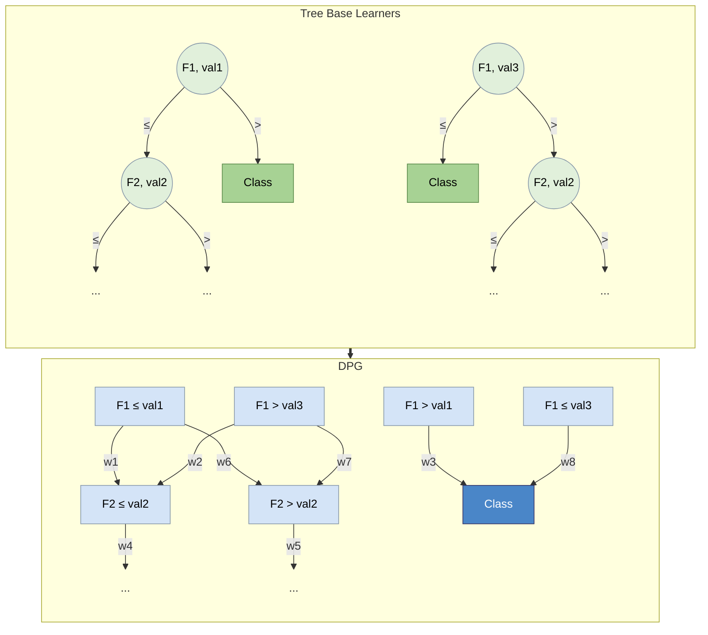

# Decision Predicate Graph (DPG)

[](LICENSE)
[](pyproject.toml)
[](https://github.com/Meta-Group/DPG/actions/workflows/ci.yml)
[](https://dpg.readthedocs.io/en/latest/)

<p align="center">
  
</p>


DPG is a model-agnostic tool to provide a global interpretation of tree-based ensemble models, addressing transparency and explainability challenges.

DPG is a graph structure that captures the tree-based ensemble model and learned dataset details, preserving the relations among features, logical decisions, and predictions towards emphasising insightful points.
DPG enables graph-based evaluations and the identification of model decisions towards facilitating comparisons between features and their associated values while offering insights into the entire model.
DPG provides descriptive metrics that enhance the understanding of the decisions inherent in the model, offering valuable insights.

```mermaid
flowchart LR
    20027246626028226493891726033110366473108170555["petal width (cm) &gt; 1.65"]
    style 20027246626028226493891726033110366473108170555 fill:#deebf7
    947984079661264961342870691539136022574948430341["petal width (cm) &gt; 1.75"]
    style 947984079661264961342870691539136022574948430341 fill:#deebf7
    171982518954274878349485416184092168691833932185["Class 1"]
    style 171982518954274878349485416184092168691833932185 fill:#9dc3e6
    990658991402966912567823093437861817801729494069["sepal width (cm) &lt;= 2.65"]
    style 990658991402966912567823093437861817801729494069 fill:#deebf7
    1155626338342785993756224741462529235742838921570["petal length (cm) &lt;= 4.95"]
    style 1155626338342785993756224741462529235742838921570 fill:#deebf7
    82584456215784096917479460091690249413155435778["sepal width (cm) &lt;= 2.75"]
    style 82584456215784096917479460091690249413155435778 fill:#deebf7
    928621589127927934620961952074257259595278295629["Class 2"]
    style 928621589127927934620961952074257259595278295629 fill:#9dc3e6
    740584513097635627496505845276455004897611201181["petal width (cm) &lt;= 1.75"]
    style 740584513097635627496505845276455004897611201181 fill:#deebf7
    337603673872932492752726340027620543413736606511["sepal width (cm) &lt;= 2.55"]
    style 337603673872932492752726340027620543413736606511 fill:#deebf7
    980626214860666167338717335551869057272345367671["petal width (cm) &gt; 1.5"]
    style 980626214860666167338717335551869057272345367671 fill:#deebf7
    762998343093703369070788183700410535435554298835["sepal width (cm) &gt; 2.75"]
    style 762998343093703369070788183700410535435554298835 fill:#deebf7
    1420176613639971807196484611010082555719409331752["petal length (cm) &gt; 4.85"]
    style 1420176613639971807196484611010082555719409331752 fill:#deebf7
    890966723073636682066365162981360678966535034956["petal length (cm) &lt;= 5.35"]
    style 890966723073636682066365162981360678966535034956 fill:#deebf7
    340188481732477051824404295008101885966561645360["sepal width (cm) &lt;= 2.25"]
    style 340188481732477051824404295008101885966561645360 fill:#deebf7
    311621331291508589808180961190090468222914004540["petal width (cm) &gt; 1.7"]
    style 311621331291508589808180961190090468222914004540 fill:#deebf7
    118822906209368786622620406787263858391785128529["sepal length (cm) &gt; 6.0"]
    style 118822906209368786622620406787263858391785128529 fill:#deebf7
    1040356948309299902273197367502802200910741155348["sepal length (cm) &gt; 6.85"]
    style 1040356948309299902273197367502802200910741155348 fill:#deebf7
    709333501413915191414856072311989723936740081826["petal width (cm) &lt;= 1.55"]
    style 709333501413915191414856072311989723936740081826 fill:#deebf7
    251229743770447802941411781111832740701315748573["sepal width (cm) &gt; 2.65"]
    style 251229743770447802941411781111832740701315748573 fill:#deebf7
    364953005201512073322336894325222498079634066492["sepal width (cm) &lt;= 2.45"]
    style 364953005201512073322336894325222498079634066492 fill:#deebf7
    59439392046478767267516126846244903572320772064["sepal length (cm) &lt;= 4.7"]
    style 59439392046478767267516126846244903572320772064 fill:#deebf7
    1147257542945440298109815666246017244067397811172["Class 0"]
    style 1147257542945440298109815666246017244067397811172 fill:#9dc3e6
    367255367419651178537191891808501301445991128366["petal length (cm) &gt; 5.35"]
    style 367255367419651178537191891808501301445991128366 fill:#deebf7
    401491908915297078065666204581122352230318673773["sepal width (cm) &gt; 2.45"]
    style 401491908915297078065666204581122352230318673773 fill:#deebf7
    1120592921524099882754632482904361819821386978950["sepal length (cm) &lt;= 6.0"]
    style 1120592921524099882754632482904361819821386978950 fill:#deebf7
    573585474223013620077006769186407898848307322087["petal length (cm) &lt;= 4.85"]
    style 573585474223013620077006769186407898848307322087 fill:#deebf7
    966918202391704686167119992696741767915073996406["sepal width (cm) &gt; 2.25"]
    style 966918202391704686167119992696741767915073996406 fill:#deebf7
    910856508481310756134865985692986956246547866890["sepal width (cm) &gt; 2.95"]
    style 910856508481310756134865985692986956246547866890 fill:#deebf7
    1428021338048660342615257991476732294081503581583["sepal length (cm) &gt; 4.7"]
    style 1428021338048660342615257991476732294081503581583 fill:#deebf7
    924013210258278874021629477832203140621876208170["sepal width (cm) &lt;= 3.4"]
    style 924013210258278874021629477832203140621876208170 fill:#deebf7
    1454275561754396346188867935618619228010796509085["petal length (cm) &lt;= 5.25"]
    style 1454275561754396346188867935618619228010796509085 fill:#deebf7
    362655504451319985859197722533626159402553560739["sepal length (cm) &gt; 6.35"]
    style 362655504451319985859197722533626159402553560739 fill:#deebf7
    927984284261413534782637668898619385740790525566["sepal length (cm) &gt; 6.75"]
    style 927984284261413534782637668898619385740790525566 fill:#deebf7
    1430084550242289152573952319964513372816921715049["petal length (cm) &lt;= 5.15"]
    style 1430084550242289152573952319964513372816921715049 fill:#deebf7
    53354603411005701715829226249389803604872317925["sepal width (cm) &gt; 3.4"]
    style 53354603411005701715829226249389803604872317925 fill:#deebf7
    626097011660713933180380276519748032994829526309["petal width (cm) &gt; 1.9"]
    style 626097011660713933180380276519748032994829526309 fill:#deebf7
    375631124196258504261993405273975813093470554725["sepal length (cm) &lt;= 5.45"]
    style 375631124196258504261993405273975813093470554725 fill:#deebf7
    1237333016937934869098747366792729700075135310240["sepal length (cm) &lt;= 6.35"]
    style 1237333016937934869098747366792729700075135310240 fill:#deebf7
    1086220596677629057317531353088711431311613406518["petal length (cm) &gt; 4.95"]
    style 1086220596677629057317531353088711431311613406518 fill:#deebf7
    725344612732739884239856357460314147744101751938["petal width (cm) &lt;= 1.5"]
    style 725344612732739884239856357460314147744101751938 fill:#deebf7
    388534224713253696026803307705489599260631342248["petal length (cm) &lt;= 4.8"]
    style 388534224713253696026803307705489599260631342248 fill:#deebf7
    638141581865990031067898579742812461592879932193["petal width (cm) &gt; 1.55"]
    style 638141581865990031067898579742812461592879932193 fill:#deebf7
    229699662298216654946136365384559907746752178532["sepal length (cm) &lt;= 6.75"]
    style 229699662298216654946136365384559907746752178532 fill:#deebf7
    596558638289476304602117053628022916713354988422["petal length (cm) &gt; 5.15"]
    style 596558638289476304602117053628022916713354988422 fill:#deebf7
    1076378016306137418140484797636215433012103174846["petal length (cm) &gt; 4.8"]
    style 1076378016306137418140484797636215433012103174846 fill:#deebf7
    702780761458410503274359059107059553775378329678["petal width (cm) &lt;= 1.9"]
    style 702780761458410503274359059107059553775378329678 fill:#deebf7
    233480085799993703345142198996825573513458999854["petal length (cm) &gt; 5.25"]
    style 233480085799993703345142198996825573513458999854 fill:#deebf7
    1457483848395039125849720518012618590763030198927["sepal length (cm) &gt; 5.45"]
    style 1457483848395039125849720518012618590763030198927 fill:#deebf7
    92880519255116869050997421623503280872342821336["petal width (cm) &gt; 0.7"]
    style 92880519255116869050997421623503280872342821336 fill:#deebf7
    1411943227993594750033556859174549188419051113355["sepal length (cm) &lt;= 6.85"]
    style 1411943227993594750033556859174549188419051113355 fill:#deebf7
    1445426462354834132243875160412146688242359425743["sepal width (cm) &lt;= 2.95"]
    style 1445426462354834132243875160412146688242359425743 fill:#deebf7
    1314006940136931729563238641481802708733831530211["sepal width (cm) &gt; 2.55"]
    style 1314006940136931729563238641481802708733831530211 fill:#deebf7
    181898515773568319354498535982620487891499359429["petal width (cm) &lt;= 1.7"]
    style 181898515773568319354498535982620487891499359429 fill:#deebf7
    350181969346862691450554476047974823735377706407["petal length (cm) &lt;= 2.5"]
    style 350181969346862691450554476047974823735377706407 fill:#deebf7
    982742991187502566594350651114266226034826696665["petal length (cm) &gt; 2.5"]
    style 982742991187502566594350651114266226034826696665 fill:#deebf7
    155464794904682121003216718812875204058849495720["petal width (cm) &lt;= 1.65"]
    style 155464794904682121003216718812875204058849495720 fill:#deebf7
    189545914041350846568929505190730729239317204349["petal width (cm) &lt;= 0.7"]
    style 189545914041350846568929505190730729239317204349 fill:#deebf7
    20027246626028226493891726033110366473108170555 -->|"1.0000"| 947984079661264961342870691539136022574948430341
    20027246626028226493891726033110366473108170555 -->|"1.0000"| 82584456215784096917479460091690249413155435778
    20027246626028226493891726033110366473108170555 -->|"1.0000"| 740584513097635627496505845276455004897611201181
    20027246626028226493891726033110366473108170555 -->|"1.0000"| 762998343093703369070788183700410535435554298835
    947984079661264961342870691539136022574948430341 -->|"1.0000"| 171982518954274878349485416184092168691833932185
    947984079661264961342870691539136022574948430341 -->|"33.0000"| 928621589127927934620961952074257259595278295629
    990658991402966912567823093437861817801729494069 -->|"1.0000"| 1155626338342785993756224741462529235742838921570
    990658991402966912567823093437861817801729494069 -->|"5.0000"| 1086220596677629057317531353088711431311613406518
    1155626338342785993756224741462529235742838921570 -->|"1.0000"| 171982518954274878349485416184092168691833932185
    1155626338342785993756224741462529235742838921570 -->|"4.0000"| 53354603411005701715829226249389803604872317925
    1155626338342785993756224741462529235742838921570 -->|"33.0000"| 924013210258278874021629477832203140621876208170
    82584456215784096917479460091690249413155435778 -->|"1.0000"| 928621589127927934620961952074257259595278295629
    82584456215784096917479460091690249413155435778 -->|"1.0000"| 251229743770447802941411781111832740701315748573
    82584456215784096917479460091690249413155435778 -->|"2.0000"| 401491908915297078065666204581122352230318673773
    82584456215784096917479460091690249413155435778 -->|"3.0000"| 364953005201512073322336894325222498079634066492
    82584456215784096917479460091690249413155435778 -->|"6.0000"| 990658991402966912567823093437861817801729494069
    740584513097635627496505845276455004897611201181 -->|"1.0000"| 928621589127927934620961952074257259595278295629
    740584513097635627496505845276455004897611201181 -->|"1.0000"| 171982518954274878349485416184092168691833932185
    740584513097635627496505845276455004897611201181 -->|"2.0000"| 367255367419651178537191891808501301445991128366
    740584513097635627496505845276455004897611201181 -->|"40.0000"| 890966723073636682066365162981360678966535034956
    337603673872932492752726340027620543413736606511 -->|"1.0000"| 980626214860666167338717335551869057272345367671
    337603673872932492752726340027620543413736606511 -->|"6.0000"| 725344612732739884239856357460314147744101751938
    980626214860666167338717335551869057272345367671 -->|"1.0000"| 928621589127927934620961952074257259595278295629
    762998343093703369070788183700410535435554298835 -->|"1.0000"| 171982518954274878349485416184092168691833932185
    762998343093703369070788183700410535435554298835 -->|"26.0000"| 1147257542945440298109815666246017244067397811172
    762998343093703369070788183700410535435554298835 -->|"32.0000"| 928621589127927934620961952074257259595278295629
    1420176613639971807196484611010082555719409331752 -->|"1.0000"| 740584513097635627496505845276455004897611201181
    1420176613639971807196484611010082555719409331752 -->|"1.0000"| 947984079661264961342870691539136022574948430341
    1420176613639971807196484611010082555719409331752 -->|"7.0000"| 82584456215784096917479460091690249413155435778
    1420176613639971807196484611010082555719409331752 -->|"32.0000"| 762998343093703369070788183700410535435554298835
    890966723073636682066365162981360678966535034956 -->|"1.0000"| 340188481732477051824404295008101885966561645360
    890966723073636682066365162981360678966535034956 -->|"39.0000"| 966918202391704686167119992696741767915073996406
    340188481732477051824404295008101885966561645360 -->|"1.0000"| 928621589127927934620961952074257259595278295629
    311621331291508589808180961190090468222914004540 -->|"1.0000"| 118822906209368786622620406787263858391785128529
    311621331291508589808180961190090468222914004540 -->|"2.0000"| 1120592921524099882754632482904361819821386978950
    118822906209368786622620406787263858391785128529 -->|"1.0000"| 928621589127927934620961952074257259595278295629
    1040356948309299902273197367502802200910741155348 -->|"1.0000"| 709333501413915191414856072311989723936740081826
    1040356948309299902273197367502802200910741155348 -->|"13.0000"| 638141581865990031067898579742812461592879932193
    1040356948309299902273197367502802200910741155348 -->|"15.0000"| 928621589127927934620961952074257259595278295629
    709333501413915191414856072311989723936740081826 -->|"1.0000"| 171982518954274878349485416184092168691833932185
    251229743770447802941411781111832740701315748573 -->|"1.0000"| 171982518954274878349485416184092168691833932185
    364953005201512073322336894325222498079634066492 -->|"1.0000"| 59439392046478767267516126846244903572320772064
    364953005201512073322336894325222498079634066492 -->|"2.0000"| 1428021338048660342615257991476732294081503581583
    59439392046478767267516126846244903572320772064 -->|"1.0000"| 1147257542945440298109815666246017244067397811172
    367255367419651178537191891808501301445991128366 -->|"2.0000"| 928621589127927934620961952074257259595278295629
    401491908915297078065666204581122352230318673773 -->|"2.0000"| 928621589127927934620961952074257259595278295629
    1120592921524099882754632482904361819821386978950 -->|"2.0000"| 171982518954274878349485416184092168691833932185
    573585474223013620077006769186407898848307322087 -->|"2.0000"| 20027246626028226493891726033110366473108170555
    573585474223013620077006769186407898848307322087 -->|"12.0000"| 171982518954274878349485416184092168691833932185
    573585474223013620077006769186407898848307322087 -->|"33.0000"| 155464794904682121003216718812875204058849495720
    966918202391704686167119992696741767915073996406 -->|"2.0000"| 20027246626028226493891726033110366473108170555
    966918202391704686167119992696741767915073996406 -->|"37.0000"| 155464794904682121003216718812875204058849495720
    910856508481310756134865985692986956246547866890 -->|"2.0000"| 1420176613639971807196484611010082555719409331752
    910856508481310756134865985692986956246547866890 -->|"12.0000"| 573585474223013620077006769186407898848307322087
    1428021338048660342615257991476732294081503581583 -->|"2.0000"| 171982518954274878349485416184092168691833932185
    924013210258278874021629477832203140621876208170 -->|"3.0000"| 311621331291508589808180961190090468222914004540
    924013210258278874021629477832203140621876208170 -->|"30.0000"| 181898515773568319354498535982620487891499359429
    1454275561754396346188867935618619228010796509085 -->|"3.0000"| 362655504451319985859197722533626159402553560739
    1454275561754396346188867935618619228010796509085 -->|"5.0000"| 1237333016937934869098747366792729700075135310240
    362655504451319985859197722533626159402553560739 -->|"3.0000"| 171982518954274878349485416184092168691833932185
    927984284261413534782637668898619385740790525566 -->|"3.0000"| 1430084550242289152573952319964513372816921715049
    927984284261413534782637668898619385740790525566 -->|"15.0000"| 596558638289476304602117053628022916713354988422
    1430084550242289152573952319964513372816921715049 -->|"3.0000"| 171982518954274878349485416184092168691833932185
    1430084550242289152573952319964513372816921715049 -->|"4.0000"| 626097011660713933180380276519748032994829526309
    1430084550242289152573952319964513372816921715049 -->|"39.0000"| 702780761458410503274359059107059553775378329678
    53354603411005701715829226249389803604872317925 -->|"4.0000"| 1147257542945440298109815666246017244067397811172
    626097011660713933180380276519748032994829526309 -->|"4.0000"| 928621589127927934620961952074257259595278295629
    375631124196258504261993405273975813093470554725 -->|"5.0000"| 82584456215784096917479460091690249413155435778
    375631124196258504261993405273975813093470554725 -->|"26.0000"| 762998343093703369070788183700410535435554298835
    1237333016937934869098747366792729700075135310240 -->|"5.0000"| 928621589127927934620961952074257259595278295629
    1086220596677629057317531353088711431311613406518 -->|"5.0000"| 928621589127927934620961952074257259595278295629
    1086220596677629057317531353088711431311613406518 -->|"8.0000"| 1454275561754396346188867935618619228010796509085
    1086220596677629057317531353088711431311613406518 -->|"14.0000"| 233480085799993703345142198996825573513458999854
    725344612732739884239856357460314147744101751938 -->|"6.0000"| 171982518954274878349485416184092168691833932185
    388534224713253696026803307705489599260631342248 -->|"7.0000"| 337603673872932492752726340027620543413736606511
    388534224713253696026803307705489599260631342248 -->|"28.0000"| 1314006940136931729563238641481802708733831530211
    638141581865990031067898579742812461592879932193 -->|"13.0000"| 928621589127927934620961952074257259595278295629
    229699662298216654946136365384559907746752178532 -->|"13.0000"| 596558638289476304602117053628022916713354988422
    229699662298216654946136365384559907746752178532 -->|"43.0000"| 1430084550242289152573952319964513372816921715049
    596558638289476304602117053628022916713354988422 -->|"28.0000"| 928621589127927934620961952074257259595278295629
    1076378016306137418140484797636215433012103174846 -->|"14.0000"| 1040356948309299902273197367502802200910741155348
    1076378016306137418140484797636215433012103174846 -->|"25.0000"| 1411943227993594750033556859174549188419051113355
    702780761458410503274359059107059553775378329678 -->|"14.0000"| 910856508481310756134865985692986956246547866890
    702780761458410503274359059107059553775378329678 -->|"25.0000"| 1445426462354834132243875160412146688242359425743
    233480085799993703345142198996825573513458999854 -->|"14.0000"| 928621589127927934620961952074257259595278295629
    1457483848395039125849720518012618590763030198927 -->|"15.0000"| 1040356948309299902273197367502802200910741155348
    1457483848395039125849720518012618590763030198927 -->|"59.0000"| 1411943227993594750033556859174549188419051113355
    92880519255116869050997421623503280872342821336 -->|"18.0000"| 927984284261413534782637668898619385740790525566
    92880519255116869050997421623503280872342821336 -->|"35.0000"| 573585474223013620077006769186407898848307322087
    92880519255116869050997421623503280872342821336 -->|"35.0000"| 388534224713253696026803307705489599260631342248
    92880519255116869050997421623503280872342821336 -->|"39.0000"| 1420176613639971807196484611010082555719409331752
    92880519255116869050997421623503280872342821336 -->|"39.0000"| 1076378016306137418140484797636215433012103174846
    92880519255116869050997421623503280872342821336 -->|"56.0000"| 229699662298216654946136365384559907746752178532
    1411943227993594750033556859174549188419051113355 -->|"22.0000"| 1086220596677629057317531353088711431311613406518
    1411943227993594750033556859174549188419051113355 -->|"25.0000"| 928621589127927934620961952074257259595278295629
    1411943227993594750033556859174549188419051113355 -->|"37.0000"| 1155626338342785993756224741462529235742838921570
    1445426462354834132243875160412146688242359425743 -->|"25.0000"| 171982518954274878349485416184092168691833932185
    1314006940136931729563238641481802708733831530211 -->|"28.0000"| 171982518954274878349485416184092168691833932185
    181898515773568319354498535982620487891499359429 -->|"30.0000"| 171982518954274878349485416184092168691833932185
    350181969346862691450554476047974823735377706407 -->|"31.0000"| 1147257542945440298109815666246017244067397811172
    982742991187502566594350651114266226034826696665 -->|"32.0000"| 947984079661264961342870691539136022574948430341
    982742991187502566594350651114266226034826696665 -->|"42.0000"| 740584513097635627496505845276455004897611201181
    155464794904682121003216718812875204058849495720 -->|"70.0000"| 171982518954274878349485416184092168691833932185
    189545914041350846568929505190730729239317204349 -->|"93.0000"| 1147257542945440298109815666246017244067397811172
```


---

## The structure
The concept behind DPG is to convert a generic tree-based ensemble model for classification into a graph, where:
- Nodes represent predicates, i.e., the feature-value associations present in each node of every tree;
- Edges denote the frequency with which these predicates are satisfied during the model training phase by the samples of the dataset.



## Metrics
The graph-based nature of DPG provides significant enhancements in the direction of a complete mapping of the ensemble structure.
| Property     | Definition | Utility |
|--------------|------------|---------|
| _Constraints_  | The intervals of values for each feature obtained from all predicates connected by a path that culminates in a given class. | Calculate the classification boundary values of each feature associated with each class. |
| _Betweenness centrality_ | Quantifies the fraction of all the shortest paths between every pair of nodes of the graph passing through the considered node. | Identify potential bottleneck nodes that correspond to crucial decisions. |
| _Local reaching centrality_ | Quantifies the proportion of other nodes reachable from the local node through its outgoing edges. | Assess the importance of nodes similarly to feature importance, but enrich the information by encompassing the values associated with features across all decisions. |
| _Community_ | A subset of nodes of the DPG which is characterised by dense interconnections between its elements and sparse connections with the other nodes of the DPG that do not belong to the community. | Understanding the characteristics of nodes to be assigned to a particular community class, identifying predominant predicates, and those that play a marginal role in the classification process. |


|Constraints | Betweenness centrality | Local reaching centrality | Community|
|------------|------------|--------------|--------------------|
 |  |  |  |
|Constraints(Class 1) = val3 < F1 ≤ val1, F2 ≤ val2 | BC(F2 ≤ val2) = 4/24 | LRC(F1 ≤ val1) = 6 / 7 | Community(Class 1) = F1 ≤ val1, F2 ≤ val2 |

---
## Installation

To install DPG locally, first clone the repository:

```bash
git clone https://github.com/Meta-Group/DPG.git
cd DPG
```

Then, install the DPG library in development mode using `pip`:
```bash
pip install -e .  
```

Alternatively, if using `pip directly`:
```bash
pip install git+https://github.com/Meta-Group/DPG.git
```
**Troubleshooting:** If you encounter dependency conflicts, we recommend using a virtual environment:

1- For Windows Users:
  ```bash
  # Create a virtual environment
  python -m venv .venv

  # Activate the virtual environment
  .venv\Scripts\activate

  # If you get execution policy errors, run this first in PowerShell as Administrator:
  Set-ExecutionPolicy -ExecutionPolicy RemoteSigned -Scope CurrentUser

  # Then install DPG
  pip install -r ./requirements.txt
  ```
2- For Linux/Mac Users:
  ```bash
  # Create a virtual environment
  python -m venv .venv

  # Activate the virtual environment
  source .venv/bin/activate

  # Install DPG
  pip install -r ./requirements.txt
  ```
3- Deactivating the Virtual Environment:
  When you're done working with DPG, you can deactivate the virtual environment:
  ```bash
  deactivate
  ```

4- Graph rendering error (`dot` not found):
  DPG plotting requires the Graphviz system executable (`dot`) in your PATH.  
  Installing the Python package `graphviz` is not sufficient on its own.

  - macOS (Homebrew):
    ```bash
    brew install graphviz
    ```
  - Ubuntu/Debian:
    ```bash
    sudo apt-get install graphviz
    ```
  - Windows (winget):
    ```powershell
    winget install Graphviz.Graphviz
    ```
---

## Documentation

For full documentation, visit [https://dpg.readthedocs.io/](https://dpg.readthedocs.io/).

To build and serve documentation locally, see [docs/README.md](docs/README.md).

---

## Example usage (Python)

You can also try DPG directly inside a Jupyter Notebook. Here's a minimal working example using the high-level API:

```python
import pandas as pd
import numpy as np
from sklearn.ensemble import RandomForestClassifier
from dpg import DPGExplainer

# Load dataset (last column assumed to be target)
df = pd.read_csv("datasets/custom.csv", index_col=0)
X = df.iloc[:, :-1]
y = df.iloc[:, -1]

# Train a simple Random Forest classifier
model = RandomForestClassifier(n_estimators=10, random_state=27)
model.fit(X, y)

# Build the DPG and extract global explanations
explainer = DPGExplainer(
    model=model,
    feature_names=X.columns,
    target_names=np.unique(y).astype(str).tolist(),
)
explanation = explainer.explain_global(X.values, communities=True)

# Render the graph to disk
explainer.plot("dpg_output", explanation, save_dir="datasets", export_pdf=True)
explainer.plot_communities("dpg_output", explanation, save_dir="datasets", export_pdf=True)
```

### Legacy API (low-level)

```python
import pandas as pd
import numpy as np
from sklearn.ensemble import RandomForestClassifier
from dpg.core import DecisionPredicateGraph
from dpg.visualizer import plot_dpg
from metrics.nodes import NodeMetrics
from metrics.edges import EdgeMetrics

df = pd.read_csv("datasets/custom.csv", index_col=0)
X = df.iloc[:, :-1]
y = df.iloc[:, -1]

model = RandomForestClassifier(n_estimators=10, random_state=27)
model.fit(X, y)

feature_names = X.columns.tolist()
class_names = np.unique(y).astype(str).tolist()
dpg = DecisionPredicateGraph(
    model=model,
    feature_names=feature_names,
    target_names=class_names
)
dot = dpg.fit(X.values)
dpg_model, nodes_list = dpg.to_networkx(dot)

df_edges = EdgeMetrics.extract_edge_metrics(dpg_model, nodes_list)
df_nodes = NodeMetrics.extract_node_metrics(dpg_model, nodes_list)

plot_dpg(
    "dpg_output",
    dot,
    df_nodes,
    df_edges,
    save_dir="datasets",
    class_flag=True,
    export_pdf=True,
)
```
#### Output:
<p align="center">
  
</p>

### API overview (high-level)

The high-level API is designed to return structured outputs so downstream tools can use them directly.

- `DPGExplainer.fit(X)`: builds the DPG structure
- `DPGExplainer.explain_global(X=None, communities=False, community_threshold=0.2)`: returns a `DPGExplanation`
- `DPGExplainer.plot(...)`: renders the standard DPG
- `DPGExplainer.plot_communities(...)`: renders a community-colored DPG

`DPGExplanation` includes `dot`, `graph`, `nodes`, `node_metrics`, `edge_metrics`, `class_boundaries`, and optional `communities`.

#### CLI scripts
The library contains two different scripts to apply DPG:
- `run_dpg_standard.py`: with this script it is possible to test DPG on a standard classification dataset provided by `sklearn` such as `iris`, `digits`, `wine`, `breast cancer`, and `diabetes`.
- `run_dpg_custom.py`: with this script it is possible to apply DPG to your classification dataset, specifying the target class.

#### DPG implementation
The library also contains two other essential scripts:
- `core.py` contains all the functions used to calculate and create the DPG and the metrics.
- `visualizer.py` contains the functions used to manage the visualization of DPG.

#### Output
The DPG output, through `run_dpg_standard.py` or `run_dpg_custom.py`, produces several files:
- the visualization of DPG in a dedicated environment, which can be zoomed and saved;
- a `.txt` file containing the DPG metrics;
- a `.csv` file containing the information about all the nodes of the DPG and their associated metrics;
- a `.txt` file containing the Random Forest statistics (accuracy, confusion matrix, classification report)

## Easy usage
Usage: `python run_dpg_standard.py --dataset <dataset_name> --n_learners <integer_number> --pv <threshold_value> --t <integer_number> --model_name <str_model_name> --dir <save_dir_path> --plot --save_plot_dir <save_plot_dir_path> --attribute <attribute> --communities --clusters --threshold_clusters <float> --class_flag --seed <int>`
Where:
- `dataset` is the name of the standard classification `sklearn` dataset to be analyzed;
- `n_learners` is the number of base learners for the Random Forest;
- `pv` is the threshold value indicating the desire to retain only those paths that occur with a frequency exceeding a specified proportion across the trees;
- `t` is the decimal precision of each feature;
- `model_name` is the name of the `sklearn` model chosen to perform classification (`RandomForestClassifier`,`BaggingClassifier`,`ExtraTreesClassifier`,`AdaBoostClassifier` are currently available);
- `dir` is the path of the directory to save the files;
- `plot` is a store_true variable which can be added to plot the DPG;
- `save_plot_dir` is the path of the directory to save the plot image;
- `attribute` is the specific node metric which can be visualized on the DPG;
- `communities` is a store_true variable which can be added to visualize communities on the DPG;
- `clusters` is a store_true variable which can be added to visualize clusters on the DPG;
- `threshold_clusters` is the threshold used to detect ambiguous nodes in clusters;
- `class_flag` is a store_true variable which can be added to highlight class nodes;
- `seed` controls the random split.
  
Disclaimer: `attribute`, `communities`, and `clusters` are mutually exclusive: DPG supports just one visualization mode at a time.

The usage of `run_dpg_custom.py` is similar, but it requires another parameter:
- `target_column`, which is the name of the column to be used as the target variable;
- while `ds` is the path of the directory where the dataset is.

#### Example `run_dpg_standard.py`
Some examples can be appreciated in the `examples` folder: https://github.com/Meta-Group/DPG/tree/main/examples

In particular, the following DPG is obtained by transforming a Random Forest with 5 base learners, trained on Iris dataset.
The used command is `python run_dpg_standard.py --dataset iris --n_learners 5 --pv 0.001 --t 2 --dir examples --plot --save_plot_dir examples`.
<p align="center">
  
</p>

The following visualizations are obtained using the same parameters as the previous example, but they show two different metrics: _Community_ and _Betweenness centrality_.
The used command for showing communities is `python run_dpg_standard.py --dataset iris --n_learners 5 --pv 0.001 --t 2 --dir examples --plot --save_plot_dir examples --communities`.
<p align="center">
  
</p>

The used command for showing a specific property is `python run_dpg_standard.py --dataset iris --n_learners 5 --pv 0.001 --t 2 --dir examples --plot --save_plot_dir examples --attribute "Betweenness centrality" --class_flag`.
<p align="center">
  
</p>

***
## Citation
If you use this for research, please cite. Here is an example BibTeX entry:

```bibtex
@inproceedings{arrighi2024dpg,
  title={Decision Predicate Graphs: Enhancing Interpretability in Tree Ensembles},
  author={Arrighi, Leonardo and Pennella, Luca and Marques Tavares, Gabriel and Barbon Junior, Sylvio},
  booktitle={World Conference on Explainable Artificial Intelligence},
  pages={311--332},
  year={2024},
  isbn = {978-3-031-63797-1},
  doi = {10.1007/978-3-031-63797-1_16},
  publisher = {Springer Nature Switzerland},
}
