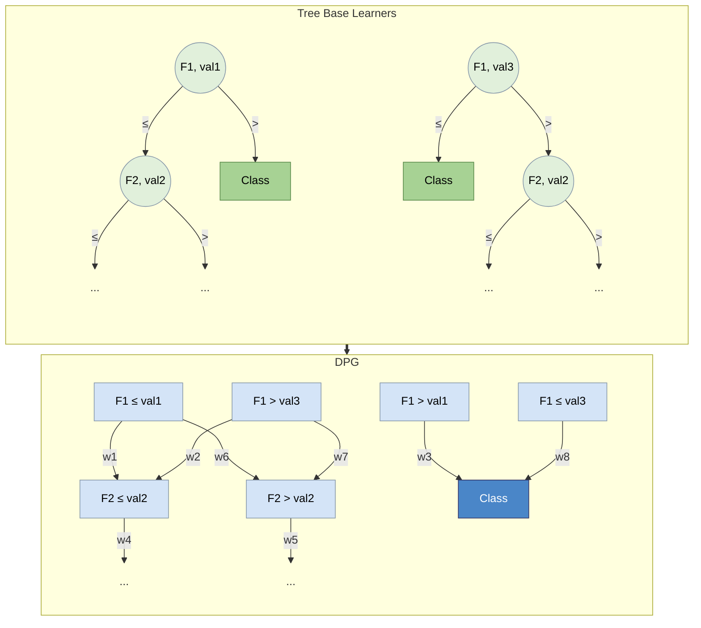

# Decision Predicate Graph (DPG)

[](LICENSE)
[](pyproject.toml)
[](https://github.com/Meta-Group/DPG/actions/workflows/ci.yml)
[](https://dpg.readthedocs.io/en/latest/)

<p align="center">
  
</p>


DPG is a model-agnostic tool to provide a global interpretation of tree-based ensemble models, addressing transparency and explainability challenges.

DPG is a graph structure that captures the tree-based ensemble model and learned dataset details, preserving the relations among features, logical decisions, and predictions towards emphasising insightful points.
DPG enables graph-based evaluations and the identification of model decisions towards facilitating comparisons between features and their associated values while offering insights into the entire model.
DPG provides descriptive metrics that enhance the understanding of the decisions inherent in the model, offering valuable insights.

```mermaid
flowchart LR
    847477981883658386414460204121394770448663895439["petal width (cm) &gt; 0.8"]
    style 847477981883658386414460204121394770448663895439 fill:#deebf7
    367255367419651178537191891808501301445991128366["petal length (cm) &gt; 5.35"]
    style 367255367419651178537191891808501301445991128366 fill:#deebf7
    928621589127927934620961952074257259595278295629["Class 2"]
    style 928621589127927934620961952074257259595278295629 fill:#9dc3e6
    740508443317274143768542537775806556368819055686["sepal width (cm) &lt;= 3.45"]
    style 740508443317274143768542537775806556368819055686 fill:#deebf7
    932169830394159498468231990100695597176443811468["sepal length (cm) &gt; 7.1"]
    style 932169830394159498468231990100695597176443811468 fill:#deebf7
    216276452006918145003540282563864157215105137770["sepal width (cm) &gt; 2.6"]
    style 216276452006918145003540282563864157215105137770 fill:#deebf7
    343917858502604793454530887801643426118446037458["sepal length (cm) &gt; 7.05"]
    style 343917858502604793454530887801643426118446037458 fill:#deebf7
    1328438251552245138835586186413240408425728373363["petal length (cm) &gt; 5.4"]
    style 1328438251552245138835586186413240408425728373363 fill:#deebf7
    121191646562286692646576052380788760693184769589["petal length (cm) &lt;= 5.4"]
    style 121191646562286692646576052380788760693184769589 fill:#deebf7
    58797218948305798924216513449824810357894850862["sepal length (cm) &lt;= 5.0"]
    style 58797218948305798924216513449824810357894850862 fill:#deebf7
    740584513097635627496505845276455004897611201181["petal width (cm) &lt;= 1.75"]
    style 740584513097635627496505845276455004897611201181 fill:#deebf7
    342117117123349403071697306733113456574223282563["sepal width (cm) &lt;= 2.6"]
    style 342117117123349403071697306733113456574223282563 fill:#deebf7
    762998343093703369070788183700410535435554298835["sepal width (cm) &gt; 2.75"]
    style 762998343093703369070788183700410535435554298835 fill:#deebf7
    630185827502430552865410453296260339634701705818["petal length (cm) &gt; 3.1"]
    style 630185827502430552865410453296260339634701705818 fill:#deebf7
    171982518954274878349485416184092168691833932185["Class 1"]
    style 171982518954274878349485416184092168691833932185 fill:#9dc3e6
    375631124196258504261993405273975813093470554725["sepal length (cm) &lt;= 5.45"]
    style 375631124196258504261993405273975813093470554725 fill:#deebf7
    82584456215784096917479460091690249413155435778["sepal width (cm) &lt;= 2.75"]
    style 82584456215784096917479460091690249413155435778 fill:#deebf7
    386336235748419626648310875536936759359939804177["petal length (cm) &gt; 3.2"]
    style 386336235748419626648310875536936759359939804177 fill:#deebf7
    1430211056767430292707122197817988587774453780846["sepal length (cm) &gt; 6.6"]
    style 1430211056767430292707122197817988587774453780846 fill:#deebf7
    115703319073283223347785747389613639958831620673["petal length (cm) &lt;= 5.05"]
    style 115703319073283223347785747389613639958831620673 fill:#deebf7
    1165470822274405337353719544741546320872523547147["sepal width (cm) &gt; 3.45"]
    style 1165470822274405337353719544741546320872523547147 fill:#deebf7
    1147257542945440298109815666246017244067397811172["Class 0"]
    style 1147257542945440298109815666246017244067397811172 fill:#9dc3e6
    1264398341130258783405987947058047208731788507777["sepal length (cm) &lt;= 7.05"]
    style 1264398341130258783405987947058047208731788507777 fill:#deebf7
    980582199507733965754791278194779303739416744173["petal length (cm) &gt; 4.75"]
    style 980582199507733965754791278194779303739416744173 fill:#deebf7
    633031963994994663144428548331584325192191038390["petal length (cm) &gt; 5.05"]
    style 633031963994994663144428548331584325192191038390 fill:#deebf7
    1420176613639971807196484611010082555719409331752["petal length (cm) &gt; 4.85"]
    style 1420176613639971807196484611010082555719409331752 fill:#deebf7
    848015377523490124006183253464891022413015834560["sepal length (cm) &lt;= 6.6"]
    style 848015377523490124006183253464891022413015834560 fill:#deebf7
    1088848347568443075395858667125229496404881602524["petal length (cm) &gt; 2.7"]
    style 1088848347568443075395858667125229496404881602524 fill:#deebf7
    876749577633510539683389891885789680561916344957["petal length (cm) &lt;= 4.75"]
    style 876749577633510539683389891885789680561916344957 fill:#deebf7
    1044616647050635083066301018916741906336769025625["petal length (cm) &lt;= 3.1"]
    style 1044616647050635083066301018916741906336769025625 fill:#deebf7
    763633975662506892272108128125293079873806506383["sepal length (cm) &lt;= 7.1"]
    style 763633975662506892272108128125293079873806506383 fill:#deebf7
    817721249234527379565738870408042655872878419902["petal length (cm) &lt;= 3.2"]
    style 817721249234527379565738870408042655872878419902 fill:#deebf7
    573585474223013620077006769186407898848307322087["petal length (cm) &lt;= 4.85"]
    style 573585474223013620077006769186407898848307322087 fill:#deebf7
    1457483848395039125849720518012618590763030198927["sepal length (cm) &gt; 5.45"]
    style 1457483848395039125849720518012618590763030198927 fill:#deebf7
    181898515773568319354498535982620487891499359429["petal width (cm) &lt;= 1.7"]
    style 181898515773568319354498535982620487891499359429 fill:#deebf7
    960298362458560681361409961977819886580957017182["petal width (cm) &lt;= 0.8"]
    style 960298362458560681361409961977819886580957017182 fill:#deebf7
    315022418006186295475886650030262907533348547963["petal length (cm) &lt;= 2.7"]
    style 315022418006186295475886650030262907533348547963 fill:#deebf7
    52444780828340747088378421267512118319341847228["sepal length (cm) &gt; 5.0"]
    style 52444780828340747088378421267512118319341847228 fill:#deebf7
    311621331291508589808180961190090468222914004540["petal width (cm) &gt; 1.7"]
    style 311621331291508589808180961190090468222914004540 fill:#deebf7
    947984079661264961342870691539136022574948430341["petal width (cm) &gt; 1.75"]
    style 947984079661264961342870691539136022574948430341 fill:#deebf7
    890966723073636682066365162981360678966535034956["petal length (cm) &lt;= 5.35"]
    style 890966723073636682066365162981360678966535034956 fill:#deebf7
    847477981883658386414460204121394770448663895439 -->|"1.0000"| 367255367419651178537191891808501301445991128366
    847477981883658386414460204121394770448663895439 -->|"1.0000"| 1328438251552245138835586186413240408425728373363
    847477981883658386414460204121394770448663895439 -->|"35.0000"| 890966723073636682066365162981360678966535034956
    847477981883658386414460204121394770448663895439 -->|"35.0000"| 121191646562286692646576052380788760693184769589
    367255367419651178537191891808501301445991128366 -->|"1.0000"| 928621589127927934620961952074257259595278295629
    740508443317274143768542537775806556368819055686 -->|"1.0000"| 932169830394159498468231990100695597176443811468
    740508443317274143768542537775806556368819055686 -->|"32.0000"| 763633975662506892272108128125293079873806506383
    932169830394159498468231990100695597176443811468 -->|"1.0000"| 928621589127927934620961952074257259595278295629
    216276452006918145003540282563864157215105137770 -->|"1.0000"| 343917858502604793454530887801643426118446037458
    216276452006918145003540282563864157215105137770 -->|"3.0000"| 1264398341130258783405987947058047208731788507777
    343917858502604793454530887801643426118446037458 -->|"1.0000"| 928621589127927934620961952074257259595278295629
    1328438251552245138835586186413240408425728373363 -->|"1.0000"| 928621589127927934620961952074257259595278295629
    121191646562286692646576052380788760693184769589 -->|"1.0000"| 58797218948305798924216513449824810357894850862
    121191646562286692646576052380788760693184769589 -->|"34.0000"| 52444780828340747088378421267512118319341847228
    58797218948305798924216513449824810357894850862 -->|"1.0000"| 928621589127927934620961952074257259595278295629
    740584513097635627496505845276455004897611201181 -->|"1.0000"| 342117117123349403071697306733113456574223282563
    740584513097635627496505845276455004897611201181 -->|"2.0000"| 1165470822274405337353719544741546320872523547147
    740584513097635627496505845276455004897611201181 -->|"4.0000"| 216276452006918145003540282563864157215105137770
    740584513097635627496505845276455004897611201181 -->|"33.0000"| 740508443317274143768542537775806556368819055686
    740584513097635627496505845276455004897611201181 -->|"34.0000"| 960298362458560681361409961977819886580957017182
    740584513097635627496505845276455004897611201181 -->|"36.0000"| 847477981883658386414460204121394770448663895439
    342117117123349403071697306733113456574223282563 -->|"1.0000"| 928621589127927934620961952074257259595278295629
    762998343093703369070788183700410535435554298835 -->|"1.0000"| 630185827502430552865410453296260339634701705818
    762998343093703369070788183700410535435554298835 -->|"32.0000"| 1044616647050635083066301018916741906336769025625
    630185827502430552865410453296260339634701705818 -->|"1.0000"| 171982518954274878349485416184092168691833932185
    375631124196258504261993405273975813093470554725 -->|"2.0000"| 82584456215784096917479460091690249413155435778
    375631124196258504261993405273975813093470554725 -->|"2.0000"| 386336235748419626648310875536936759359939804177
    375631124196258504261993405273975813093470554725 -->|"33.0000"| 762998343093703369070788183700410535435554298835
    375631124196258504261993405273975813093470554725 -->|"33.0000"| 817721249234527379565738870408042655872878419902
    82584456215784096917479460091690249413155435778 -->|"2.0000"| 171982518954274878349485416184092168691833932185
    386336235748419626648310875536936759359939804177 -->|"2.0000"| 171982518954274878349485416184092168691833932185
    1430211056767430292707122197817988587774453780846 -->|"2.0000"| 115703319073283223347785747389613639958831620673
    1430211056767430292707122197817988587774453780846 -->|"17.0000"| 633031963994994663144428548331584325192191038390
    115703319073283223347785747389613639958831620673 -->|"2.0000"| 171982518954274878349485416184092168691833932185
    1165470822274405337353719544741546320872523547147 -->|"2.0000"| 1147257542945440298109815666246017244067397811172
    1264398341130258783405987947058047208731788507777 -->|"3.0000"| 171982518954274878349485416184092168691833932185
    980582199507733965754791278194779303739416744173 -->|"5.0000"| 740584513097635627496505845276455004897611201181
    980582199507733965754791278194779303739416744173 -->|"35.0000"| 947984079661264961342870691539136022574948430341
    633031963994994663144428548331584325192191038390 -->|"17.0000"| 928621589127927934620961952074257259595278295629
    1420176613639971807196484611010082555719409331752 -->|"18.0000"| 848015377523490124006183253464891022413015834560
    1420176613639971807196484611010082555719409331752 -->|"19.0000"| 1430211056767430292707122197817988587774453780846
    848015377523490124006183253464891022413015834560 -->|"18.0000"| 928621589127927934620961952074257259595278295629
    1088848347568443075395858667125229496404881602524 -->|"31.0000"| 876749577633510539683389891885789680561916344957
    1088848347568443075395858667125229496404881602524 -->|"40.0000"| 980582199507733965754791278194779303739416744173
    876749577633510539683389891885789680561916344957 -->|"31.0000"| 171982518954274878349485416184092168691833932185
    1044616647050635083066301018916741906336769025625 -->|"32.0000"| 1147257542945440298109815666246017244067397811172
    763633975662506892272108128125293079873806506383 -->|"32.0000"| 171982518954274878349485416184092168691833932185
    817721249234527379565738870408042655872878419902 -->|"33.0000"| 1147257542945440298109815666246017244067397811172
    573585474223013620077006769186407898848307322087 -->|"33.0000"| 1457483848395039125849720518012618590763030198927
    573585474223013620077006769186407898848307322087 -->|"35.0000"| 375631124196258504261993405273975813093470554725
    1457483848395039125849720518012618590763030198927 -->|"33.0000"| 171982518954274878349485416184092168691833932185
    1457483848395039125849720518012618590763030198927 -->|"35.0000"| 947984079661264961342870691539136022574948430341
    1457483848395039125849720518012618590763030198927 -->|"35.0000"| 740584513097635627496505845276455004897611201181
    181898515773568319354498535982620487891499359429 -->|"34.0000"| 960298362458560681361409961977819886580957017182
    181898515773568319354498535982620487891499359429 -->|"36.0000"| 847477981883658386414460204121394770448663895439
    960298362458560681361409961977819886580957017182 -->|"68.0000"| 1147257542945440298109815666246017244067397811172
    315022418006186295475886650030262907533348547963 -->|"34.0000"| 1147257542945440298109815666246017244067397811172
    52444780828340747088378421267512118319341847228 -->|"34.0000"| 171982518954274878349485416184092168691833932185
    311621331291508589808180961190090468222914004540 -->|"35.0000"| 928621589127927934620961952074257259595278295629
    947984079661264961342870691539136022574948430341 -->|"105.0000"| 928621589127927934620961952074257259595278295629
    890966723073636682066365162981360678966535034956 -->|"35.0000"| 171982518954274878349485416184092168691833932185
```



---

## The structure
The concept behind DPG is to convert a generic tree-based ensemble model for classification into a graph, where:
- Nodes represent predicates, i.e., the feature-value associations present in each node of every tree;
- Edges denote the frequency with which these predicates are satisfied during the model training phase by the samples of the dataset.



## Metrics
The graph-based nature of DPG provides significant enhancements in the direction of a complete mapping of the ensemble structure.
| Property     | Definition | Utility |
|--------------|------------|---------|
| _Constraints_  | The intervals of values for each feature obtained from all predicates connected by a path that culminates in a given class. | Calculate the classification boundary values of each feature associated with each class. |
| _Betweenness centrality_ | Quantifies the fraction of all the shortest paths between every pair of nodes of the graph passing through the considered node. | Identify potential bottleneck nodes that correspond to crucial decisions. |
| _Local reaching centrality_ | Quantifies the proportion of other nodes reachable from the local node through its outgoing edges. | Assess the importance of nodes similarly to feature importance, but enrich the information by encompassing the values associated with features across all decisions. |
| _Community_ | A subset of nodes of the DPG which is characterised by dense interconnections between its elements and sparse connections with the other nodes of the DPG that do not belong to the community. | Understanding the characteristics of nodes to be assigned to a particular community class, identifying predominant predicates, and those that play a marginal role in the classification process. |


|Constraints | Betweenness centrality | Local reaching centrality | Community|
|------------|------------|--------------|--------------------|
 |  |  |  |
|Constraints(Class 1) = val3 < F1 ≤ val1, F2 ≤ val2 | BC(F2 ≤ val2) = 4/24 | LRC(F1 ≤ val1) = 6 / 7 | Community(Class 1) = F1 ≤ val1, F2 ≤ val2 |

---
## Installation

To install DPG locally, first clone the repository:

```bash
git clone https://github.com/Meta-Group/DPG.git
cd DPG
```

Then, install the DPG library in development mode using `pip`:
```bash
pip install -e .  
```

Alternatively, if using `pip directly`:
```bash
pip install git+https://github.com/Meta-Group/DPG.git
```
**Troubleshooting:** If you encounter dependency conflicts, we recommend using a virtual environment:

1- For Windows Users:
  ```bash
  # Create a virtual environment
  python -m venv .venv

  # Activate the virtual environment
  .venv\Scripts\activate

  # If you get execution policy errors, run this first in PowerShell as Administrator:
  Set-ExecutionPolicy -ExecutionPolicy RemoteSigned -Scope CurrentUser

  # Then install DPG
  pip install -r ./requirements.txt
  ```
2- For Linux/Mac Users:
  ```bash
  # Create a virtual environment
  python -m venv .venv

  # Activate the virtual environment
  source .venv/bin/activate

  # Install DPG
  pip install -r ./requirements.txt
  ```
3- Deactivating the Virtual Environment:
  When you're done working with DPG, you can deactivate the virtual environment:
  ```bash
  deactivate
  ```

4- Graph rendering error (`dot` not found):
  DPG plotting requires the Graphviz system executable (`dot`) in your PATH.  
  Installing the Python package `graphviz` is not sufficient on its own.

  - macOS (Homebrew):
    ```bash
    brew install graphviz
    ```
  - Ubuntu/Debian:
    ```bash
    sudo apt-get install graphviz
    ```
  - Windows (winget):
    ```powershell
    winget install Graphviz.Graphviz
    ```
---

## Documentation

For full documentation, visit [https://dpg.readthedocs.io/](https://dpg.readthedocs.io/).

To build and serve documentation locally, see [docs/README.md](docs/README.md).

---

## Example usage (Python)

You can also try DPG directly inside a Jupyter Notebook. Here's a minimal working example using the high-level API:

```python
import pandas as pd
import numpy as np
from sklearn.ensemble import RandomForestClassifier
from dpg import DPGExplainer

# Load dataset (last column assumed to be target)
df = pd.read_csv("datasets/custom.csv", index_col=0)
X = df.iloc[:, :-1]
y = df.iloc[:, -1]

# Train a simple Random Forest classifier
model = RandomForestClassifier(n_estimators=10, random_state=27)
model.fit(X, y)

# Build the DPG and extract global explanations
explainer = DPGExplainer(
    model=model,
    feature_names=X.columns,
    target_names=np.unique(y).astype(str).tolist(),
)
explanation = explainer.explain_global(X.values, communities=True)

# Render the graph to disk
explainer.plot("dpg_output", explanation, save_dir="datasets", export_pdf=True)
explainer.plot_communities("dpg_output", explanation, save_dir="datasets", export_pdf=True)
```

### Legacy API (low-level)

```python
import pandas as pd
import numpy as np
from sklearn.ensemble import RandomForestClassifier
from dpg.core import DecisionPredicateGraph
from dpg.visualizer import plot_dpg
from metrics.nodes import NodeMetrics
from metrics.edges import EdgeMetrics

df = pd.read_csv("datasets/custom.csv", index_col=0)
X = df.iloc[:, :-1]
y = df.iloc[:, -1]

model = RandomForestClassifier(n_estimators=10, random_state=27)
model.fit(X, y)

feature_names = X.columns.tolist()
class_names = np.unique(y).astype(str).tolist()
dpg = DecisionPredicateGraph(
    model=model,
    feature_names=feature_names,
    target_names=class_names
)
dot = dpg.fit(X.values)
dpg_model, nodes_list = dpg.to_networkx(dot)

df_edges = EdgeMetrics.extract_edge_metrics(dpg_model, nodes_list)
df_nodes = NodeMetrics.extract_node_metrics(dpg_model, nodes_list)

plot_dpg(
    "dpg_output",
    dot,
    df_nodes,
    df_edges,
    save_dir="datasets",
    class_flag=True,
    export_pdf=True,
)
```
#### Output:
<p align="center">
  
</p>

### API overview (high-level)

The high-level API is designed to return structured outputs so downstream tools can use them directly.

- `DPGExplainer.fit(X)`: builds the DPG structure
- `DPGExplainer.explain_global(X=None, communities=False, community_threshold=0.2)`: returns a `DPGExplanation`
- `DPGExplainer.plot(...)`: renders the standard DPG
- `DPGExplainer.plot_communities(...)`: renders a community-colored DPG

`DPGExplanation` includes `dot`, `graph`, `nodes`, `node_metrics`, `edge_metrics`, `class_boundaries`, and optional `communities`.

#### CLI scripts
The library contains two different scripts to apply DPG:
- `run_dpg_standard.py`: with this script it is possible to test DPG on a standard classification dataset provided by `sklearn` such as `iris`, `digits`, `wine`, `breast cancer`, and `diabetes`.
- `run_dpg_custom.py`: with this script it is possible to apply DPG to your classification dataset, specifying the target class.

#### DPG implementation
The library also contains two other essential scripts:
- `core.py` contains all the functions used to calculate and create the DPG and the metrics.
- `visualizer.py` contains the functions used to manage the visualization of DPG.

#### Output
The DPG output, through `run_dpg_standard.py` or `run_dpg_custom.py`, produces several files:
- the visualization of DPG in a dedicated environment, which can be zoomed and saved;
- a `.txt` file containing the DPG metrics;
- a `.csv` file containing the information about all the nodes of the DPG and their associated metrics;
- a `.txt` file containing the Random Forest statistics (accuracy, confusion matrix, classification report)

## Easy usage
Usage: `python run_dpg_standard.py --dataset <dataset_name> --n_learners <integer_number> --pv <threshold_value> --t <integer_number> --model_name <str_model_name> --dir <save_dir_path> --plot --save_plot_dir <save_plot_dir_path> --attribute <attribute> --communities --clusters --threshold_clusters <float> --class_flag --seed <int>`
Where:
- `dataset` is the name of the standard classification `sklearn` dataset to be analyzed;
- `n_learners` is the number of base learners for the Random Forest;
- `pv` is the threshold value indicating the desire to retain only those paths that occur with a frequency exceeding a specified proportion across the trees;
- `t` is the decimal precision of each feature;
- `model_name` is the name of the `sklearn` model chosen to perform classification (`RandomForestClassifier`,`BaggingClassifier`,`ExtraTreesClassifier`,`AdaBoostClassifier` are currently available);
- `dir` is the path of the directory to save the files;
- `plot` is a store_true variable which can be added to plot the DPG;
- `save_plot_dir` is the path of the directory to save the plot image;
- `attribute` is the specific node metric which can be visualized on the DPG;
- `communities` is a store_true variable which can be added to visualize communities on the DPG;
- `clusters` is a store_true variable which can be added to visualize clusters on the DPG;
- `threshold_clusters` is the threshold used to detect ambiguous nodes in clusters;
- `class_flag` is a store_true variable which can be added to highlight class nodes;
- `seed` controls the random split.
  
Disclaimer: `attribute`, `communities`, and `clusters` are mutually exclusive: DPG supports just one visualization mode at a time.

The usage of `run_dpg_custom.py` is similar, but it requires another parameter:
- `target_column`, which is the name of the column to be used as the target variable;
- while `ds` is the path of the directory where the dataset is.

#### Example `run_dpg_standard.py`
Some examples can be appreciated in the `examples` folder: https://github.com/Meta-Group/DPG/tree/main/examples

In particular, the following DPG is obtained by transforming a Random Forest with 5 base learners, trained on Iris dataset.
The used command is `python run_dpg_standard.py --dataset iris --n_learners 5 --pv 0.001 --t 2 --dir examples --plot --save_plot_dir examples`.
<p align="center">
  
</p>

The following visualizations are obtained using the same parameters as the previous example, but they show two different metrics: _Community_ and _Betweenness centrality_.
The used command for showing communities is `python run_dpg_standard.py --dataset iris --n_learners 5 --pv 0.001 --t 2 --dir examples --plot --save_plot_dir examples --communities`.
<p align="center">
  
</p>

The used command for showing a specific property is `python run_dpg_standard.py --dataset iris --n_learners 5 --pv 0.001 --t 2 --dir examples --plot --save_plot_dir examples --attribute "Betweenness centrality" --class_flag`.
<p align="center">
  
</p>

***
## Citation
If you use this for research, please cite. Here is an example BibTeX entry:

```bibtex
@inproceedings{arrighi2024dpg,
  title={Decision Predicate Graphs: Enhancing Interpretability in Tree Ensembles},
  author={Arrighi, Leonardo and Pennella, Luca and Marques Tavares, Gabriel and Barbon Junior, Sylvio},
  booktitle={World Conference on Explainable Artificial Intelligence},
  pages={311--332},
  year={2024},
  isbn = {978-3-031-63797-1},
  doi = {10.1007/978-3-031-63797-1_16},
  publisher = {Springer Nature Switzerland},
}
