# DPGExplainer Saga Benchmarks — Episode 3: Breast Cancer

Episode 1 (Iris) introduced the workflow. Episode 2 (Wine) stress-tested it on richer multiclass overlap.

This episode applies the same protocol to Breast Cancer Wisconsin, a binary dataset with 30 features and dense threshold interactions.

What we do:
1. Train a baseline Random Forest.
2. Extract a Decision Predicate Graph (DPG).
3. Compare classical feature importance vs structural graph signals.
4. Add TreeSHAP for attribution-level comparison.
5. Read bottlenecks, communities, and class-wise ranges.

---

## 1. Baseline model check

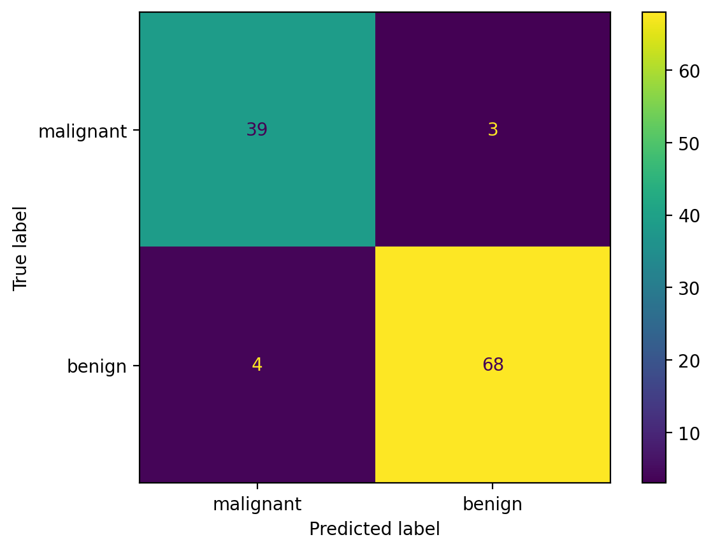

Confusion matrix (`rows=true`, `cols=predicted`):

```text
[[39  3]
 [ 4 68]]
```

Classification report:

```text
              precision    recall  f1-score   support

malignant       0.9070    0.9286    0.9176        42
benign          0.9577    0.9444    0.9510        72

accuracy                             0.9386       114
macro avg       0.9324    0.9365    0.9343       114
weighted avg    0.9390    0.9386    0.9387       114
```

Takeaway: predictive quality is strong enough to support global and local interpretability analysis.

---

## 2. Data geometry at a glance

Breast Cancer has 30 features, so we visualize a representative subset.

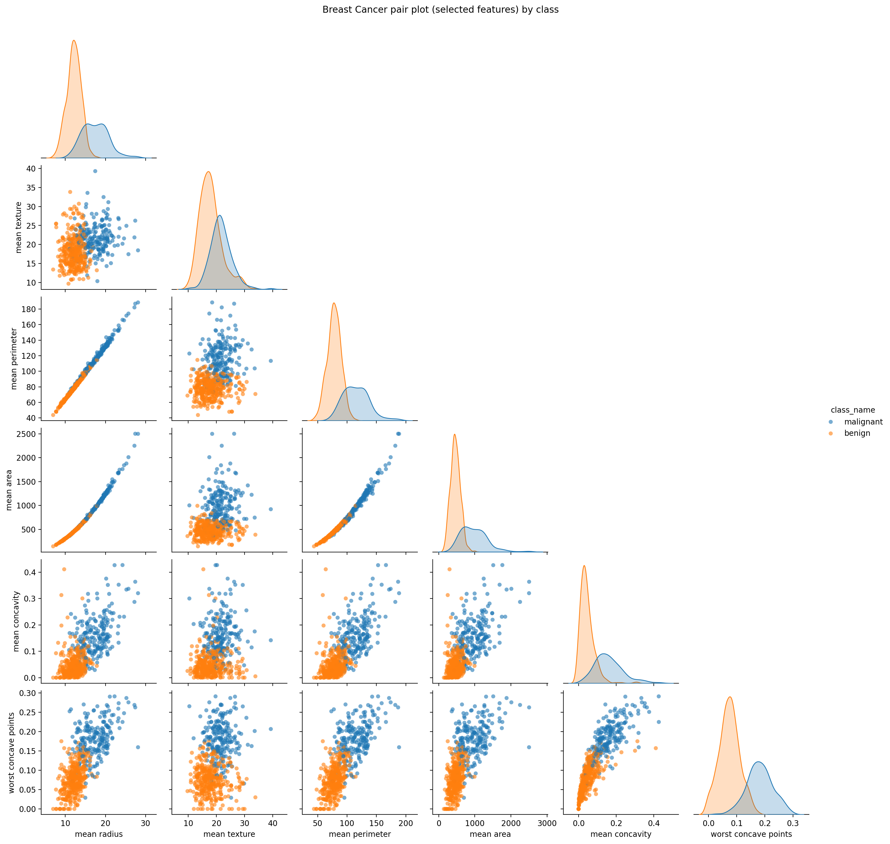

Compared with Iris and Wine:
- the feature space is larger,
- separation is good but not trivial,
- multiple interacting thresholds are needed,
- this is exactly where graph-level explanations become useful.

---

## 3. Why DPG on top of Random Forest

Random Forest importance is useful, but it is still a feature ranking. It does not directly show routing logic across the ensemble.

DPG adds:
- predicate-level nodes (`feature <= threshold`, `feature > threshold`),
- transitions between predicates along tree paths,
- graph metrics (LRC, BC, communities) to expose decision structure.

Run configuration detail used here:
- `decimal_threshold=2` in DPG config, which keeps predicate thresholds readable.

---

## 4. LRC vs Random Forest importance

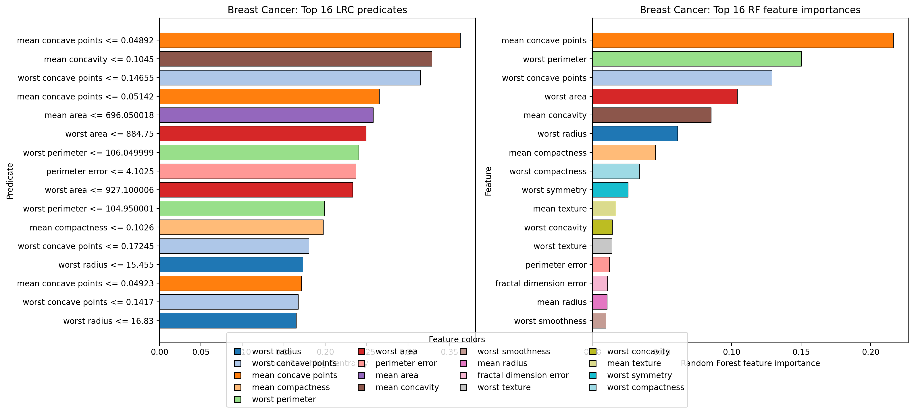

Top-10 LRC predicates:

| Predicate | LRC |
|---|---:|
| `worst perimeter <= 104.95` | 1.411381 |
| `worst symmetry <= 0.36` | 1.198727 |
| `perimeter error <= 4.12` | 0.937071 |
| `worst area <= 884.75` | 0.858048 |
| `mean concavity <= 0.1` | 0.731993 |
| `worst radius <= 15.45` | 0.712965 |
| `worst perimeter > 104.95` | 0.685177 |
| `mean concave points <= 0.05` | 0.673035 |
| `worst concave points <= 0.15` | 0.616178 |
| `worst compactness <= 0.72` | 0.590121 |

Top RF features:

| Feature | RF importance |
|---|---:|
| `mean concave points` | 0.216308 |
| `worst perimeter` | 0.150218 |
| `worst concave points` | 0.128881 |
| `worst area` | 0.104094 |
| `mean concavity` | 0.085259 |
| `worst radius` | 0.061277 |
| `mean compactness` | 0.045290 |
| `worst compactness` | 0.033751 |
| `worst symmetry` | 0.025696 |
| `mean texture` | 0.016796 |

Discussion:
- RF tells us which features reduce impurity most across trees.
- LRC tells us which exact predicates are structurally central in routing.
- The model exposes a strong bifurcation around `worst perimeter` with both `<= 104.95` and `> 104.95` as high-LRC predicates.
- 8 of the top-10 RF features also appear in top-LRC predicates (feature-level match), indicating good agreement between statistical relevance and structural influence.

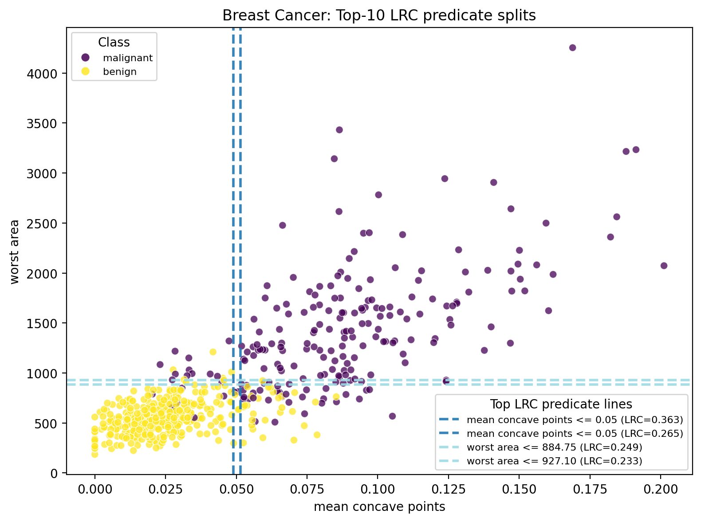

---

## 5. LRC predicates vs TreeSHAP (same RF model)

This section keeps the same fitted Random Forest and compares:
- LRC at full predicate level,
- TreeSHAP at feature attribution level.

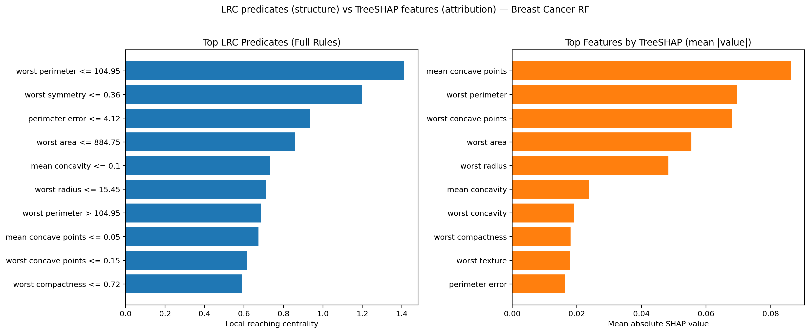

Top TreeSHAP features (mean absolute contribution):

| Feature | TreeSHAP mean \|value\| |
|---|---:|
| `mean concave points` | 0.086209 |
| `worst perimeter` | 0.069712 |
| `worst concave points` | 0.067940 |
| `worst area` | 0.055501 |
| `worst radius` | 0.048390 |
| `mean concavity` | 0.023725 |
| `worst concavity` | 0.019222 |
| `worst compactness` | 0.018096 |
| `worst texture` | 0.017986 |
| `perimeter error` | 0.016226 |

Observed agreement:
- Feature-level overlap between top LRC predicates (mapped to base features) and top TreeSHAP features is **8/10**:
  `mean concave points`, `mean concavity`, `perimeter error`, `worst area`,
  `worst compactness`, `worst concave points`, `worst perimeter`, `worst radius`.

Where TreeSHAP is stronger:
- local attribution for an individual sample,
- signed contribution analysis,
- additive decomposition of model output.

Where LRC is stronger:
- explicit threshold semantics (`<=` / `>`),
- global routing centrality,
- direct connection to bottlenecks and communities in the graph.

Local example from this run (`sample index 256`, predicted `malignant`):
- Top TreeSHAP pushes: `mean concave points`, `worst concave points`, `worst perimeter`, `worst radius`, `worst area`.
- Top active high-LRC predicates: `worst symmetry <= 0.36`, `worst perimeter > 104.95`, `worst compactness <= 0.72`, `mean compactness > 0.1`, `mean concave points > 0.05`.

Practical reading:
- TreeSHAP explains how much each feature moved this prediction.
- LRC explains which threshold rules carry the strongest structural traffic in the model.

---

## 6. BC as bottleneck logic

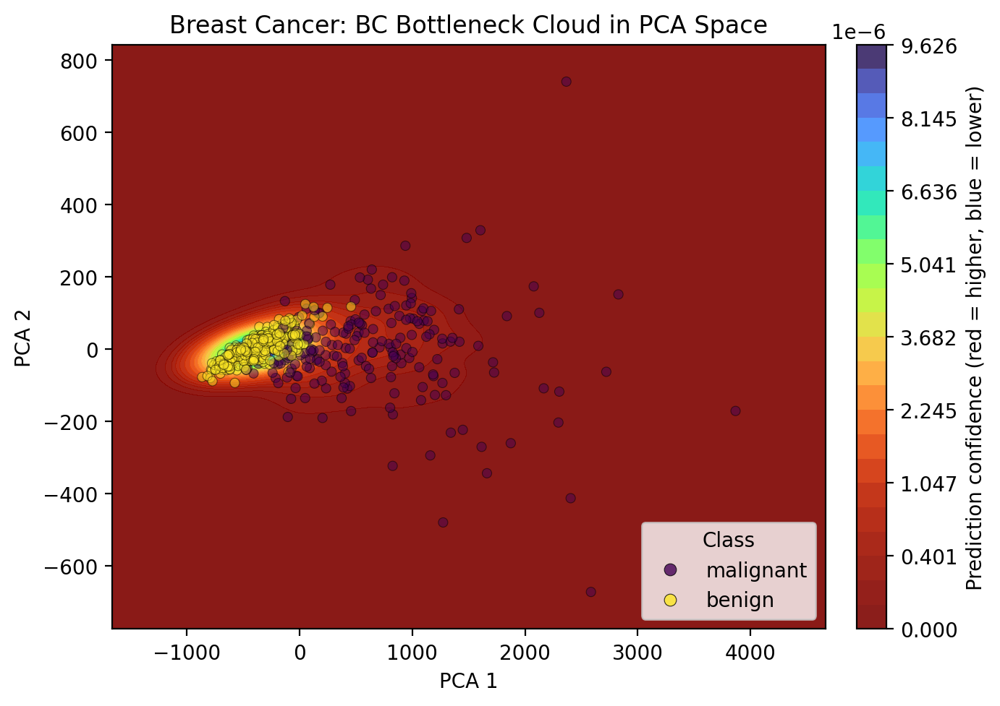

Top BC predicates:
- `fractal dimension error > 0.0` (0.011913)
- `worst fractal dimension <= 0.08` (0.007774)
- `mean area <= 567.65` (0.007572)
- `mean concavity <= 0.05` (0.005225)
- `worst concave points <= 0.11` (0.005073)

Discussion:
- BC highlights bridge predicates between dense decision zones.
- These are often transition rules where routing ambiguity is higher.

---

## 7. Global DPG and communities

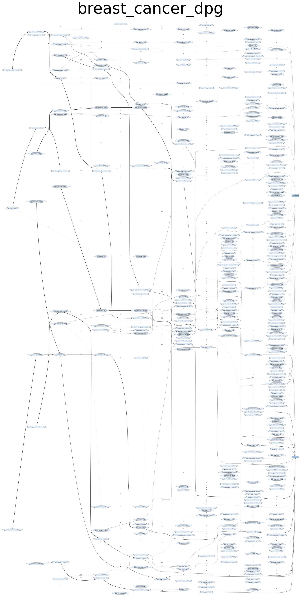

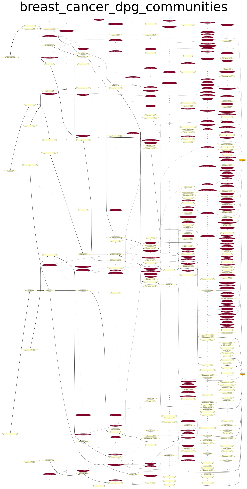

Communities summarize recurring decision themes across many tree paths, turning path-level complexity into interpretable modules.

---

## 8. Communities and class complexity

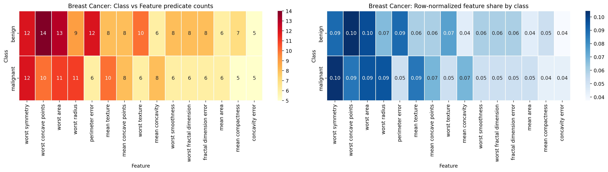

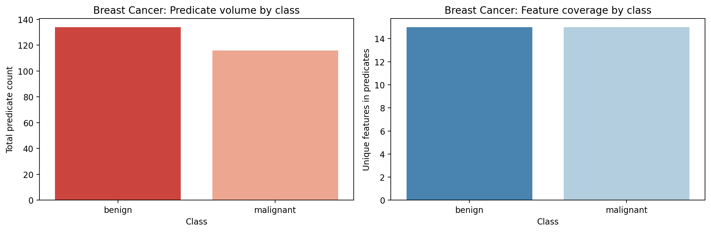

Class complexity summary:
- `benign`: `159` predicates across `30` features.
- `malignant`: `122` predicates across `26` features.

Discussion:
- both classes involve broad feature coverage,
- `benign` receives a larger rule budget in this RF+DPG configuration,
- overlap and asymmetry are visible in feature-level predicate concentration.

---

## 9. DPG ranges vs empirical data ranges

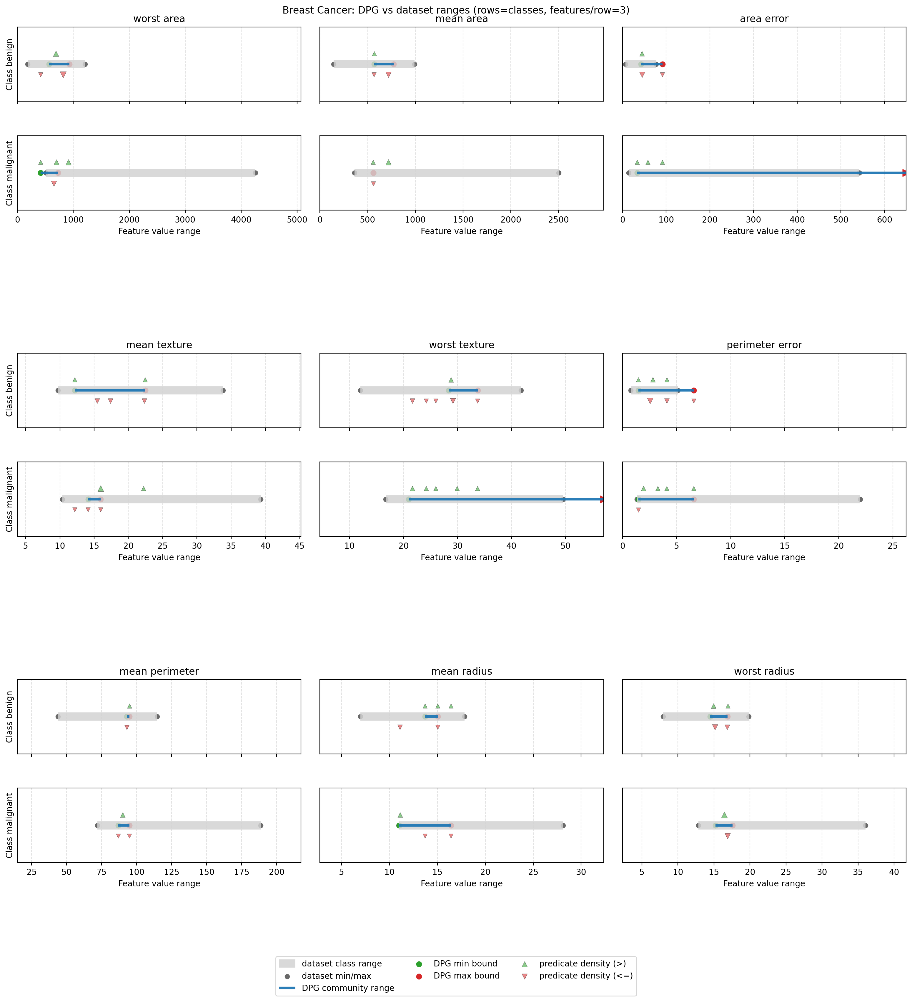

Boundary summary:
- `benign`: 30 modeled features, 28 finite lower bounds, 28 finite upper bounds.
- `malignant`: 26 modeled features, 22 finite lower bounds, 21 finite upper bounds.

Interpretation:
- boundaries are often asymmetric,
- several constraints are one-sided,
- DPG gives a direct consistency layer between model logic and observed class ranges.

---

## 10. Takeaway messages

- Random Forest importance is a strong first signal, but not the full story.
- DPG adds rule topology: central thresholds, bottlenecks, and communities.
- TreeSHAP adds local and additive attribution clarity.
- On this benchmark, LRC and TreeSHAP strongly agree on major drivers (8/10 overlap), while still answering different questions.

One-line conclusion:
**Use TreeSHAP for local contribution narratives and DPG/LRC for global rule-structure narratives. Together, they provide a fuller explanation than either alone.**

---

## 11. References

### DPG
- Arrighi, L., Pennella, L., Marques Tavares, G., Barbon Junior, S.  
  **Decision Predicate Graphs: Enhancing Interpretability in Tree Ensembles**.  
  *World Conference on Explainable Artificial Intelligence*, 311-332.  
  https://link.springer.com/chapter/10.1007/978-3-031-63797-1_16

- Ceschin, M., Arrighi, L., Longo, L., Barbon Junior, S.  
  **Extending Decision Predicate Graphs for Comprehensive Explanation of Isolation Forest**.  
  *World Conference on Explainable Artificial Intelligence*, 271-293.  
  https://link.springer.com/chapter/10.1007/978-3-032-08324-1_12

### SHAP / TreeSHAP
- Lundberg, S. M., Lee, S.-I.  
  **A Unified Approach to Interpreting Model Predictions**.  
  *NeurIPS 2017*.  
  https://proceedings.neurips.cc/paper_files/paper/2017/hash/8a20a8621978632d76c43dfd28b67767-Abstract.html

- Lundberg, S. M., Erion, G. G., Chen, H., et al.  
  **From Local Explanations to Global Understanding with Explainable AI for Trees**.  
  *Nature Machine Intelligence* 2, 56-67 (2020).  
  https://www.nature.com/articles/s42256-019-0138-9

- SHAP documentation (TreeExplainer):  
  https://shap.readthedocs.io/en/latest/generated/shap.TreeExplainer.html

### Saga context
- Episode 1 (Iris):  
  https://medium.com/@sbarbonjr/dpgexplainer-saga-benchmarks-episode-1-iris-c8816db2857d
