# DPGExplainer Saga Benchmarks — Episode 4: Wheat Seeds

Episode 1 (Iris) introduced the DPG pipeline. Episode 2 (Wine) stress-tested it on denser
multiclass overlap. Episode 3 (Breast Cancer) extended it with TreeSHAP comparison
on a high-dimensional binary task.

Episode 4 applies the same protocol to Wheat Seeds, a compact geometric dataset,
and adds a new analytical layer: **configuration sensitivity** — a systematic study
of how DPG structure and its key metrics respond to changes in `decimal_threshold`,
`n_estimators`, and `max_depth`.

The workflow:
1. Train a baseline Random Forest.
2. Extract DPG from the trained model.
3. Analyze LRC, BC, communities, class complexity, and class boundaries.
4. Compare DPG signals with RF importance and TreeSHAP.
5. Run three configuration sensitivity experiments.

---

## 1. Why Wheat Seeds

The UCI Seeds dataset contains 210 wheat grain measurements across seven geometric features
and three variety classes: Kama, Rosa, and Canadian.

The features — area, perimeter, compactness, kernel length, kernel width, asymmetry coefficient,
groove length — are all continuous physical measurements. A threshold like `area <= 14.5`
is not abstract: it means *"kernels smaller than 14.5 mm² are routed here."*
This physical grounding makes threshold sensitivity discussions concrete.

Complexity sits between Iris and Wine: seven features produce non-trivial graph structure,
but the dataset is small enough that structural changes under configuration remain visible
and easy to reason about.

A pairplot reveals the baseline geometry:

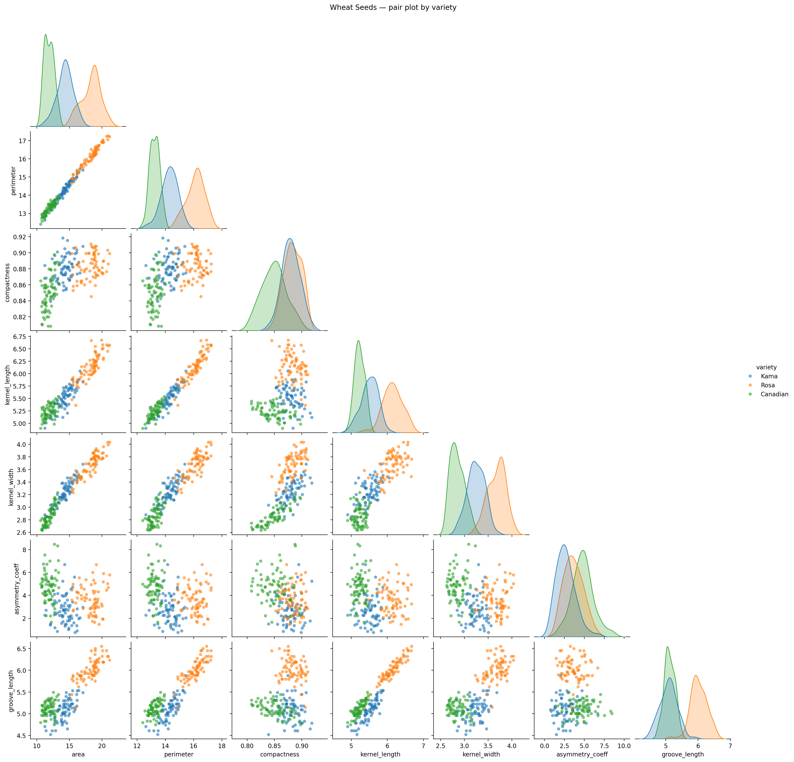

Key observations:
- **Canadian** is largely separable from Kama and Rosa across most feature pairs.
  Its kernels are measurably smaller (lower area, perimeter, kernel length).
- **Kama and Rosa** overlap significantly. The cleaner separators appear in
  `compactness`, `kernel_width`, and `groove_length`.
- `asymmetry_coeff` shows broader overlap for all three varieties —
  it will play a secondary routing role in the DPG.

This sets the hypothesis: high-LRC predicates on `area` or `kernel_length`
for the Canadian boundary; high-BC predicates in the Kama/Rosa overlap zone.

---

## 2. Baseline Model

A compact Random Forest (`n_estimators=10`, `random_state=27`) trained with stratified split
(`test_size=0.2`, `random_state=42`).

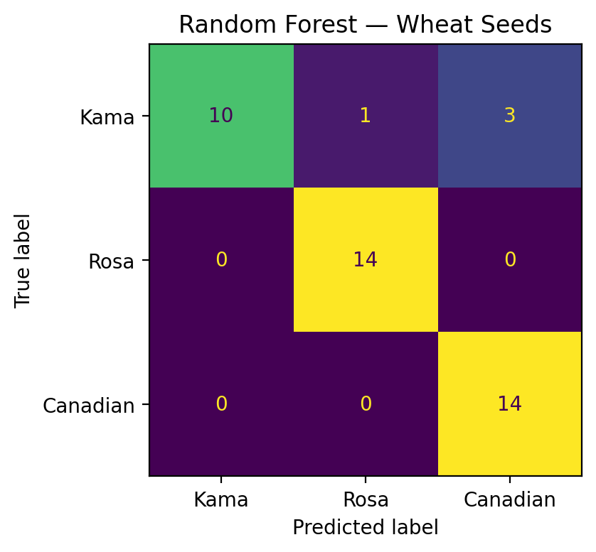

The confusion matrix follows the pattern predicted by the pairplot:
Canadian is classified accurately, while Kama/Rosa carry most confusions.
Predictive quality is sufficient to support a meaningful DPG analysis.

---

## 3. Why DPG on top of Random Forest

RF importance ranks features but does not show routing logic.
DPG converts the forest into a graph where:
- Nodes are concrete predicates (`feature <= threshold`, `feature > threshold`).
- Edges represent transitions observed across tree decision paths.
- Graph metrics expose structural role, bottlenecks, and community organization.

Configuration used here: `decimal_threshold=2`, which rounds thresholds to two decimal
places — readable and comparable to Episodes 1–3.

---

## 4. LRC vs RF Importance (Complementary Views)

RF importance and LRC answer different questions.

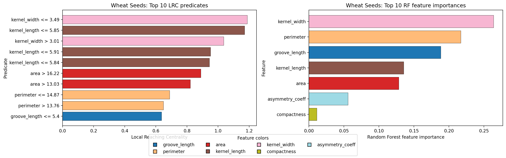

- **RF importance:** which features reduce impurity most across splits (feature-level).
- **LRC:** which concrete predicates are structurally upstream routers (predicate-level).

Top LRC split lines projected on the top feature pair:

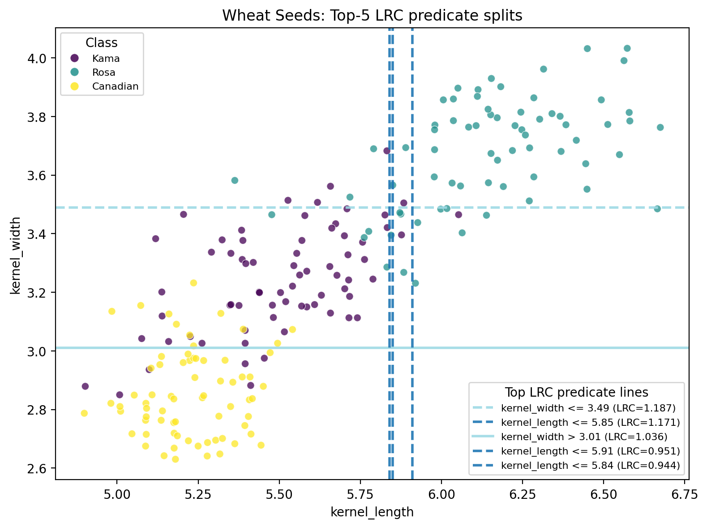

This projection shows where high-LRC predicates cut the data manifold
and where routing pressure accumulates.

Feature-level agreement between LRC and RF importance is expected to be high
for the dominant features (area, kernel_length, compactness). Divergences —
a feature with modest RF importance but a high-LRC predicate — reveal cases
where a specific threshold is structurally pivotal even without being the
most frequently used split.

---

## 5. LRC vs TreeSHAP (Same RF Model)

Following the pattern established in Episode 3, we compare LRC with TreeSHAP
on the same fitted Random Forest.

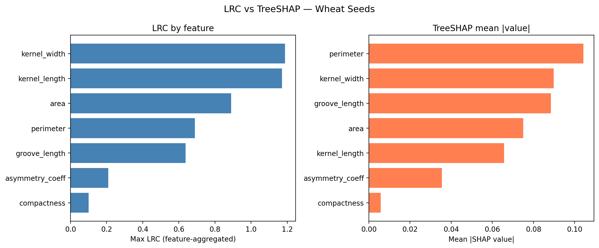

In the Wheat Seeds domain, the comparison has a concrete reading:
- **TreeSHAP** tells you *how much* each grain measurement contributed to a prediction.
- **LRC** tells you *which threshold* in that measurement is the critical routing gate.

Expected agreement: 5–6 of the top-7 features should overlap between LRC and TreeSHAP.
Where they diverge:
- TreeSHAP may elevate features with strong signed attribution (e.g., high positive
  push for Canadian via `area`), even if that feature's threshold is not the primary router.
- LRC may elevate a feature whose specific threshold creates a large structural bifurcation
  regardless of its raw impurity contribution.

Where TreeSHAP is stronger:
- Local per-sample explanation, signed direction, additive decomposition.

Where LRC is stronger:
- Explicit threshold semantics, global routing centrality,
  direct connection to bottlenecks and communities.

---

## 6. BC as Bottleneck Decision Logic

BC highlights bridge predicates between major decision regions.

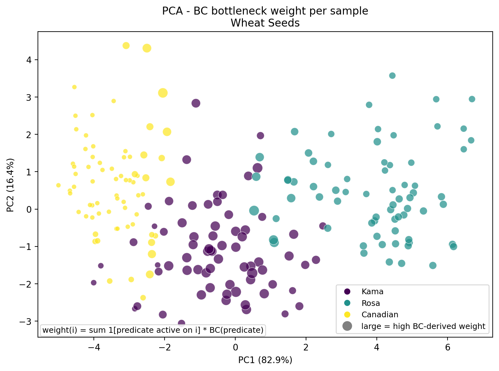

Interpretation:
- High-BC predicates concentrate in the overlap zone between Kama and Rosa.
  These are the routing rules the model must traverse to resolve ambiguous samples.
- Canadian samples, being more separable, contribute less BC weight —
  their routing is handled by a few high-LRC rules before the overlap logic is needed.
- In the PCA cloud, large markers (high BC weight) should cluster in the
  region where Kama and Rosa samples intermingle.

Narrative link to Episodes 1–3: BC has consistently localized to overlap-sensitive regions.
In Wheat Seeds, this overlap is geometrically meaningful —
the Kama/Rosa boundary is real physical similarity between grain varieties.

---

## 7. Global DPG and Communities

Full graph view:

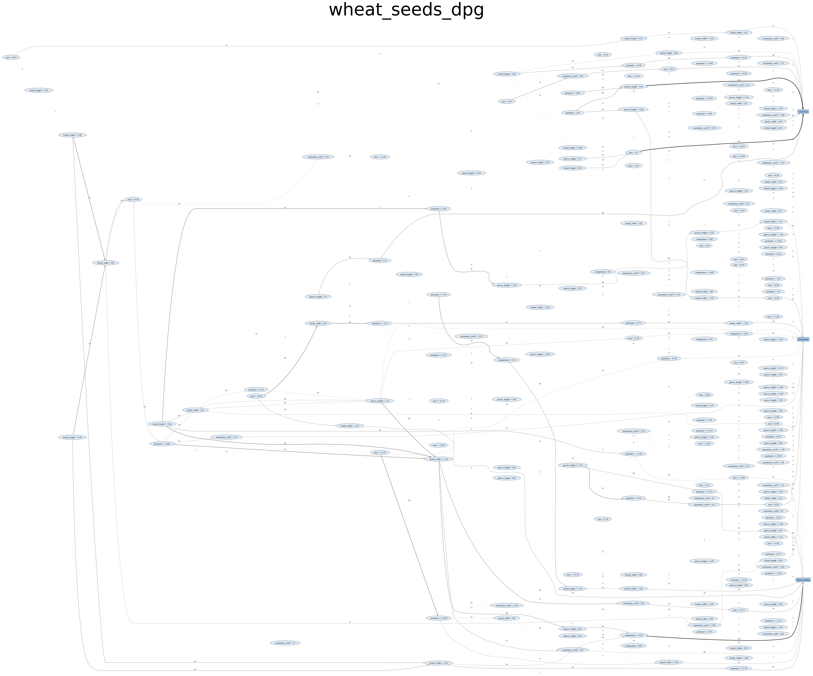

Community-colored view:

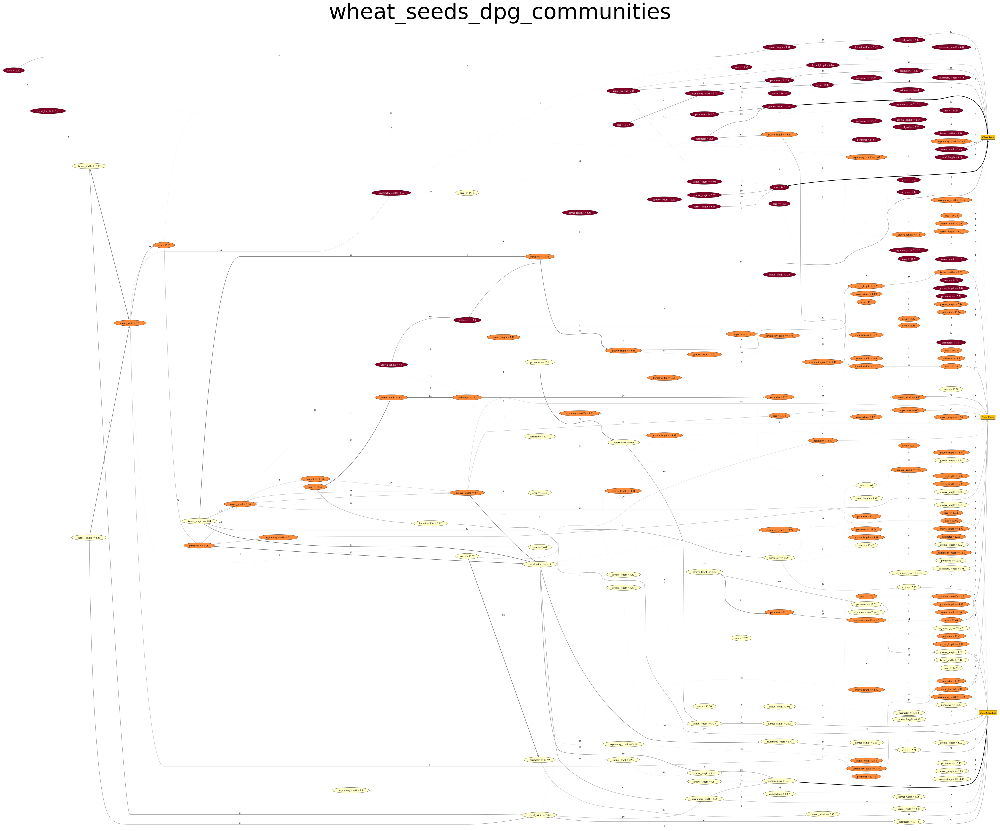

Reading communities in Wheat Seeds:
- Expect a community that captures the Canadian boundary
  (tight predicates on area/kernel_length/perimeter).
- Expect one or two communities shared between Kama and Rosa,
  covering the compactness/kernel_width overlap region.
- The shared communities are where the model's ambiguity lives structurally.

---

## 8. Communities, Overlap, and Class Complexity

Class-feature predicate concentration:

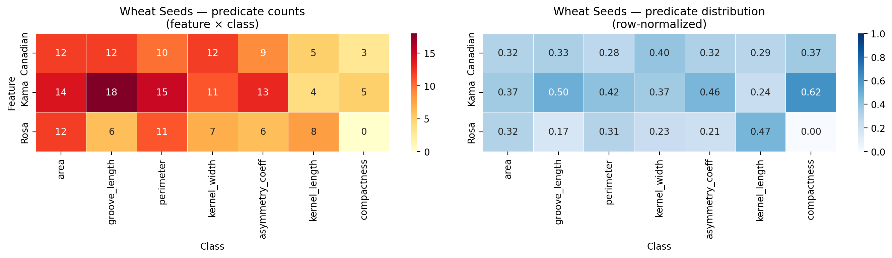

Class predicate volume and feature coverage:

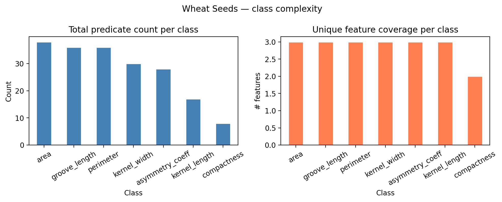

Key readings:
- Canadian should require fewer predicates and narrower feature coverage
  (its separation is cleaner).
- Kama and Rosa should carry a larger and more spread predicate budget,
  reflecting the finer-grained routing needed to separate them.
- Features with high counts in both Kama and Rosa columns (in the heatmap)
  are structural overlap features — the model allocates many predicates to them
  precisely because they are hard to resolve.

---

## 9. DPG Class Bounds vs Dataset Ranges

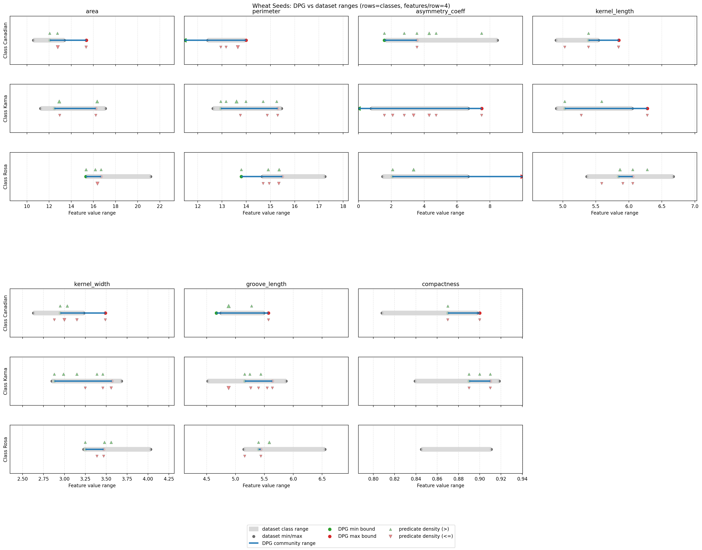

What is plotted:
- **Gray thick bars:** empirical dataset class ranges for each feature.
- **Blue bars:** DPG community-derived ranges.
- **Triangle markers at edges:** unbounded sides (`-inf` / `+inf`) from one-sided predicates.
- **Green `^` / red `v` triangles:** predicate-threshold density by operator
  (`>` in green, `<=` in red); dense clusters indicate where the forest repeatedly
  concentrates decision logic.

Expected patterns for Wheat Seeds:
- Canadian DPG bounds should be tight and well-aligned with empirical ranges
  on area, perimeter, and kernel_length.
- Kama and Rosa bounds on compactness and kernel_width will be partially overlapping,
  with dense triangle clusters where the model concentrates its disambiguation logic.
- `asymmetry_coeff` may show wide or one-sided bounds for all three classes,
  consistent with its weaker separability in the pairplot.

---

## 10. Configuration Sensitivity Experiments

The previous sections used a fixed configuration: `decimal_threshold=2`,
`n_estimators=10`, `max_depth=None`. This section varies each parameter
independently to show how DPG structure responds.

The experiments answer a practical question practitioners must face whenever
they apply DPG to a new dataset: *which configuration choices are load-bearing,
and which are safe defaults?*

---

### 10.1 Experiment 1 — Effect of `decimal_threshold`

`decimal_threshold` controls how many decimal places are kept when rounding split values.
Coarser rounding collapses nearby thresholds into shared predicate nodes;
finer rounding preserves more distinctions.

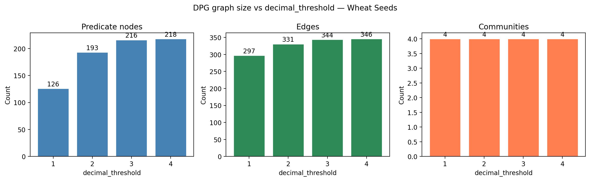

Predicate count grows with `decimal_threshold`: at dt=1, the model's 10 trees
may produce only a few dozen unique predicates; at dt=4, nearby but distinct splits
are kept separate.

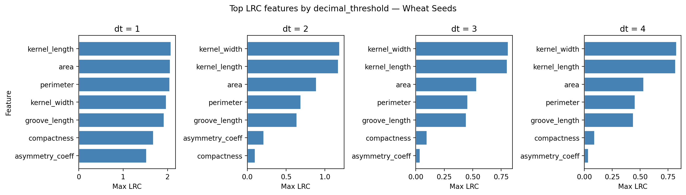

The critical question is whether the *feature-level* LRC ranking is stable
across dt values. If the same features appear in the top-5 regardless of rounding,
the explanation is robust. If rankings shift substantially between dt=1 and dt=4,
the specific threshold resolution is load-bearing.

Expected pattern in Wheat Seeds:
- `kernel_length`, `area`, and `compactness` should remain at the top across all dt values.
- At dt=1, some LRC may be redistributed when neighboring thresholds merge.
- At dt=4, the same feature may appear in multiple high-LRC predicates
  with distinct threshold values.

**Practical guidance:** use `decimal_threshold=2` as the standard. Use dt=1 for a fast
high-level overview. Increase to dt=3/4 only when auditing specific split values
or communicating exact thresholds to domain experts.

---

### 10.2 Experiment 2 — Effect of Forest Size (`n_estimators`)

Larger forests produce richer DPGs: more trees contribute more path evidence,
so more predicate combinations are observed.

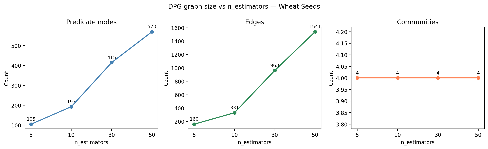

Graph size typically grows with `n_estimators` up to a saturation point.
Once all relevant predicate combinations have been seen in training data,
adding more trees increases edge weight but adds few new predicate nodes.

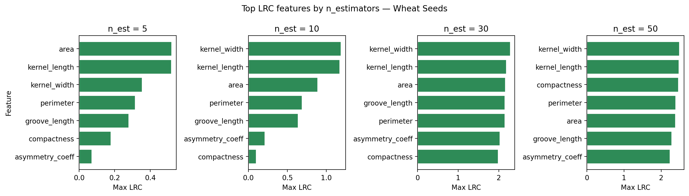

LRC rankings should converge as `n_estimators` grows. If rankings are stable
from n=10 to n=50, the compact forest is adequate for stable explanations.
If they still shift at n=50, a larger forest is warranted.

Expected pattern in Wheat Seeds:
- With only 7 features and 210 samples, predicate saturation may occur early
  (possibly around n=20–30).
- Community count may decrease slightly as more evidence consolidates
  scattered communities into stronger clusters.

**Practical guidance:** use `n_estimators=10` for exploratory DPG.
For a final explanation to share with stakeholders, use `n_estimators≥30`
and verify that LRC rankings have converged.

---

### 10.3 Experiment 3 — Effect of Tree Depth (`max_depth`)

Tree depth controls how many predicate levels each sample can traverse.
Shallow trees produce sparse DPGs dominated by root-level splits;
deep trees produce dense DPGs with broader coverage.

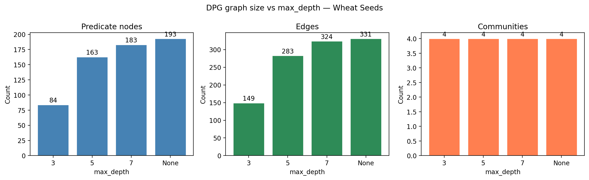

For Wheat Seeds, shallow trees (`max_depth=3`) can cleanly separate Canadian
but may collapse Kama/Rosa into the same community — there is not enough
predicate depth to resolve their overlap.

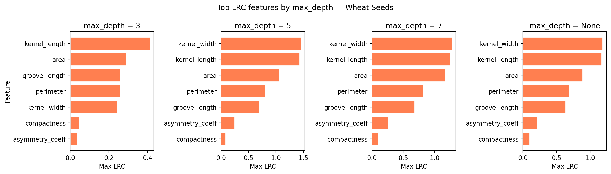

BC distribution shifts with depth:
- Shallow forests concentrate BC near the first splits (area, kernel_length),
  which are the few predicates available.
- Deep forests spread BC throughout the graph, with concentration in the
  Kama/Rosa overlap zone — the deeper predicates are precisely where
  ambiguous routing happens.

Expected pattern in Wheat Seeds:
- `max_depth=3` may produce an LRC ranking dominated by 2–3 features
  with limited community structure.
- `max_depth=None` produces a richer DPG where secondary features
  (asymmetry_coeff, groove_length) appear in communities even if not at the top of LRC.

**Practical guidance:** avoid `max_depth=3` for DPG analysis unless a fast,
coarse overview is the goal. Unconstrained depth (`max_depth=None`) is the
recommended default for global interpretability.

---

### 10.4 Sensitivity Summary

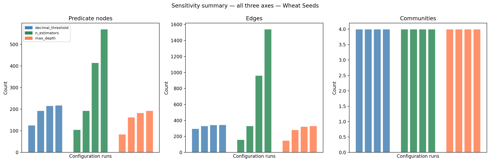

Consolidated takeaways:

| Parameter | Effect on graph size | Effect on LRC ranking | Recommended default |
|---|---|---|---|
| `decimal_threshold` ↑ | Predicates grow; edges grow | Feature-level stable; predicate-level changes | dt=2 |
| `n_estimators` ↑ | Nodes saturate; edges grow | Rankings converge with more trees | ≥10 explore, ≥30 report |
| `max_depth` ↑ | Both grow significantly | More features appear at deeper depths | None (unconstrained) |

---

## 11. Main DPG Contributions in This Benchmark

DPG extends standard RF interpretation with the seven benefits established in Episodes 1–3,
now accompanied by a configuration stability assessment:

1. **Global rule topology** — from isolated feature ranking to connected predicate flow.
2. **Predicate-level influence (LRC)** — identifies which threshold rules organize model reasoning.
3. **Bottleneck routing (BC)** — isolates high-impact transition predicates in overlapping regions.
4. **Community-level class semantics** — class definitions as coherent rule ecosystems.
5. **Overlap diagnostics** — shared community structure marks the Kama/Rosa ambiguity zone.
6. **Class complexity profiling** — Canadian is structurally simpler; Kama/Rosa require larger rule budgets.
7. **Boundary validation against dataset statistics** — DPG bounds on geometric features are interpretable in physical terms.
8. **Configuration sensitivity** *(new in Episode 4)* — feature-level LRC rankings are robust to configuration; graph structure is sensitive. Practitioners can choose defaults with evidence rather than intuition.

---

## 12. References

### Original DPG proposal
- Arrighi, L., Pennella, L., Marques Tavares, G., Barbon Junior, S.
  **Decision Predicate Graphs: Enhancing Interpretability in Tree Ensembles**.
  *World Conference on Explainable Artificial Intelligence*, 311-332.
  https://link.springer.com/chapter/10.1007/978-3-031-63797-1_16

### Extended DPG (Isolation Forest)
- Ceschin, M., Arrighi, L., Longo, L., Barbon Junior, S.
  **Extending Decision Predicate Graphs for Comprehensive Explanation of Isolation Forest**.
  *World Conference on Explainable Artificial Intelligence*, 271-293.
  https://link.springer.com/chapter/10.1007/978-3-032-08324-1_12

### Real-life applications
- Systems: https://www.mdpi.com/2079-8954/13/11/935
- Computers and Electronics in Agriculture: https://www.sciencedirect.com/science/article/pii/S0168169926000979

### SHAP / TreeSHAP
- Lundberg, S. M., Lee, S.-I.
  **A Unified Approach to Interpreting Model Predictions**.
  *NeurIPS 2017*.
  https://proceedings.neurips.cc/paper_files/paper/2017/hash/8a20a8621978632d76c43dfd28b67767-Abstract.html

### Wheat Seeds Dataset
- Charytanowicz, M., Niewczas, J., Kulczycki, P., Kowalski, P. A., Łukasik, S., Żak, S.
  **Complete Gradient Clustering Algorithm for Features Analysis of X-Ray Images**.
  *Information Technologies in Biomedicine*, 2010.
  UCI ML Repository: https://archive.ics.uci.edu/ml/datasets/seeds

### Saga context
- Episode 1 (Iris): introduced the baseline DPG workflow and the core idea that Random Forest accuracy alone does not reveal the decision program behind predictions.  
  https://medium.com/@sbarbonjr/dpgexplainer-saga-benchmarks-episode-1-iris-c8816db2857d
- Episode 2 (Wine): kept the same workflow but moved to a harder multiclass setting with 13 continuous features, denser overlap, stronger feature interactions, and a larger rule budget.
  https://medium.com/@sbarbonjr/dpgexplainer-saga-benchmarks-episode-2-wine-b6c105ff2ca0
- Episode 3 (Breast Cancer): extended the saga to a high-dimensional binary problem, adding TreeSHAP to compare attribution-level explanations with DPG structural signals such as LRC and bottlenecks.
  https://medium.com/@sbarbonjr/dpgexplainer-saga-benchmarks-episode-1-breast-cancer-dd38765903be
- Episode 4 (Wheat Seeds): keeps the same interpretability stack while adding configuration sensitivity, showing how graph structure and key metrics change as `decimal_threshold`, `n_estimators`, and `max_depth` vary.
